# Kvartal CRM — техническая и продуктовая документация

> Документ описывает систему **по состоянию кодовой базы** на коммите `0fa8abe`
> (ветка `claude/charming-shannon-w89yov`, 24 коммита, ~26 400 строк в `app/`).
> Всё, чего в коде нет, помечено как **не реализовано** — домыслов в документе нет.
>
> Аудитория: технический директор, продуктовый архитектор, новый разработчик,
> которому систему передают «с нуля».

## Содержание

| № | Раздел |
|---|--------|
| 1 | [Executive Summary](#1-executive-summary) |
| 2 | [Технологический стек](#2-технологический-стек) |
| 3 | [Архитектура проекта](#3-архитектура-проекта) |
| 4 | [Все страницы CRM](#4-все-страницы-crm) |
| 5 | [Роли пользователей](#5-роли-пользователей) |
| 6 | [Бизнес-flow](#6-бизнес-flow) |
| 7 | [Сущности системы](#7-сущности-системы) |
| 8 | [Stores](#8-stores) |
| 9 | [Components](#9-components) |
| 10 | [Design System](#10-design-system) |
| 11 | [Автоматизации](#11-автоматизации) |
| 12 | [Шахматка / Генплан / Фасад](#12-шахматка--генплан--фасад) |
| 13 | [Клиенты](#13-клиенты) |
| 14 | [Плюсы архитектуры](#14-плюсы-архитектуры) |
| 15 | [Минусы и технический долг](#15-минусы-и-технический-долг) |
| 16 | [Roadmap](#16-roadmap) |

---

# 1. Executive Summary

## 1.1 Что это за продукт

**Kvartal** — CRM для отдела продаж застройщика. Не универсальная CRM с полями
«сделка/контакт», а система, в центре которой стоит **фонд недвижимости**:
проект (ЖК) → дом → помещение, и всё остальное — заявки, брони, договоры,
платежи, документы — навешено на конкретную квартиру.

Технически это **фронтенд-прототип на Nuxt 4 без бэкенда**: данные генерируются
детерминированным сидом и живут в памяти вкладки, слой `repositories/*`
имитирует сетевой API (`await repo.fetchX()` с задержкой). Это не «черновик
вёрстки»: в системе реализованы сквозные процессы (лид → договор → график
платежей), конструктор автоматизаций, ролевой доступ и агрегация клиентского
досье — но всё исполняется в браузере.

## 1.2 Для кого

| Роль на рынке | Что закрывает Kvartal |
|---|---|
| Застройщик (1–N ЖК) | единый фонд, шахматка, прайс, статусы помещений |
| Отдел продаж | воронка заявок, подбор, брони, мастер сделок, календарь дня |
| Руководитель отдела | согласование скидок, аналитика по менеджерам, конверсия |
| Финансы / бухгалтерия | график платежей, доска оплат, просрочки, подтверждение платежей |
| Юрист | договоры и документы сделки |
| Директор / собственник | выручка в работе, воронка, реализация фонда |

## 1.3 Какую проблему решает

1. **Фонд и продажи в одном месте.** В типовой связке «Excel-шахматка + amoCRM»
   статус квартиры живёт в файле, а сделка — в CRM; они расходятся к обеду.
   Здесь статус помещения меняется только через бронь/договор и пишется в
   историю помещения (`UnitHistoryEntry`).
2. **Подбор вместо перебора.** Один компонент подбора (`UnitPicker`) с общим
   фильтром и выделением работает в шахматке, на фасаде, на плане этажа, в
   списке, в карточке заявки и в мастере сделок.
3. **Согласование скидки как процесс,** а не как звонок руководителю: маршрут
   «менеджер → руководитель → директор» зависит от величины скидки, каждое
   решение остаётся в истории (`DiscountRequest.steps`).
4. **Операционный день, а не отчётность.** Дашборд отвечает на вопрос «что
   делать сегодня» (план дня, просрочки, платежи и показы сегодня), аналитика
   компании — отдельным блоком и только тем, кому видны её деньги.
5. **Автоматизации без разработчика.** Правило = данные (`триггер → условия →
   действия`), собирается в интерфейсе.

## 1.4 Чем отличается от обычной CRM

| Обычная CRM | Kvartal |
|---|---|
| Сделка — абстрактная сумма | Сделка привязана к конкретному помещению фонда |
| Каталог объектов — справочник | Фонд — интерактивная шахматка, фасад, генплан, план этажа с разметкой областей |
| Клиент = контакт | `Lead` (заявка в воронке) и `Client` (покупатель с договором) — разные сущности; досье клиента **вычисляется** из договоров, графиков и платежей |
| Автоматизации — код интегратора | Конструктор правил в UI, встроенные сценарии описаны теми же правилами |
| Дашборд — графики | Операционный центр: лента дня, просрочки, платежи/показы сегодня |
| Права — галочки на разделы | Право = возможность (`Capability`), закрывающая меню, маршрут и кнопку одновременно |

## 1.5 Границы прототипа (важно для нового CTO)

| Есть | Нет |
|---|---|
| Полный UI-слой, 32 страницы, 113 компонентов | Сервера, БД, API |
| Ролевая модель и middleware | Серверной авторизации и проверки прав |
| Детерминированные демо-данные (сид 88420) | Персистентности: F5 возвращает сид |
| Имитация API в `repositories/*` | Обработки ошибок, ретраев, оффлайна |
| Импорт/экспорт XLSX в браузере | Генерации PDF/DOCX (печать через браузер) |
| Конструктор автоматизаций | Планировщика на сервере (правила по времени считаются при входе) |
| — | Тестов и CI (ни одного `*.spec.ts`) |

---

# 2. Технологический стек

## 2.1 Зависимости (из `package.json`)

| Пакет | Версия | Роль в системе |
|---|---|---|
| `nuxt` | ^4.5.2 | каркас: роутинг по файлам, автоимпорты, сборка (Vite), плагины/middleware |
| `vue` | ^3.5.43 | реактивность, `<script setup>`, Composition API |
| `vue-router` | ^5.3.1 | транзитивно через Nuxt, маршруты из `app/pages` |
| `typescript` | ^5.9.3 | `typescript.strict: true` в `nuxt.config` |
| `vue-tsc` | ^3.3.11 | статическая проверка шаблонов и скриптов (`npx vue-tsc --noEmit`) |
| `pinia` + `@pinia/nuxt` | ^4.0.3 / ^1.0.2 | 11 сторов состояния, автоимпорт `useXStore()` |
| `@vueuse/nuxt` | ^15.0.0 | `onClickOutside`, `useIntersectionObserver`, `useElementSize`, `useEventListener` |
| `@nuxtjs/tailwindcss` | ^6.14.0 | утилитарные классы поверх CSS-токенов |
| `@nuxt/icon` + `@iconify-json/ph` | ^2.5.1 | иконки Phosphor, **собираются в бандл** (`fallbackToApi: false`) |
| `xlsx` (SheetJS) | ^0.18.5 | импорт шахматки из Excel и экспорт подборок/реестра клиентов |

Dev-скрипты: `dev`, `build`, `generate`, `preview`, `postinstall` (`nuxt prepare`).

## 2.2 Ключевые решения конфигурации (`nuxt.config.ts`)

```ts
ssr: false            // SPA: сессия и мок-данные живут в браузере,
                      // нет гонки гидратации на авторизации
components: [ ... ]   // 12 директорий с pathPrefix: false → <AppButton/>, <UnitPicker/>
icon: {
  mode: 'svg',
  clientBundle: { scan: { globInclude: ['app/**/*.{vue,ts}'] } },
  serverBundle: { collections: ['ph'] },
  fallbackToApi: false,   // закрытый контур застройщика: иконки не ходят в интернет
}
typescript: { strict: true }
```

Шрифты (`Onest`, `Unbounded`) подключены ссылкой на Google Fonts в `app.head` —
**единственная внешняя зависимость рантайма** (см. технический долг, L-33).

## 2.3 Архитектурные слои

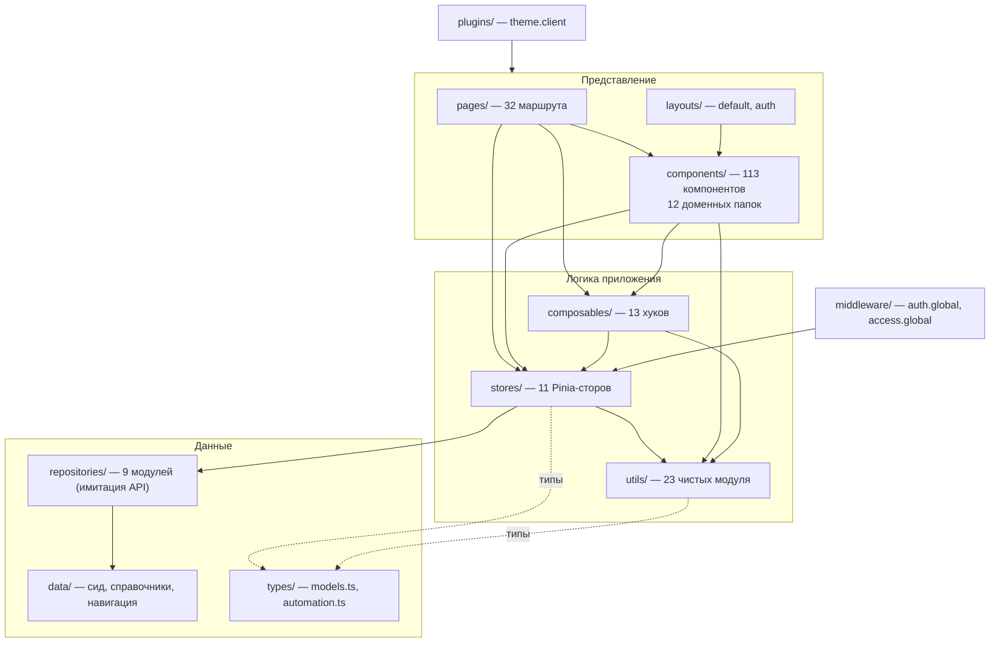

Правило слоёв, соблюдаемое в коде:

* компоненты **не ходят** в `repositories` напрямую — только через сторы;
* сторы **не импортируют** `data/seed` для записи, читают через репозитории
  (исключения: `TODAY` импортируется в `sales`/`deals` как «сегодня» системы);
* `utils/*` — чистые функции без обращения к сторам (проверяется тем, что их
  можно вызвать из теста; тестов, впрочем, нет).

## 2.4 Роутинг

* Файловый роутинг Nuxt: `app/pages/**` → маршруты. Динамические сегменты:
  `objects/[id]`, `buildings/[buildingId]`, `contracts/[id]`, `pricing/[id]`,
  `facades/[buildingId]/[facadeId]`.
* Два глобальных middleware (выполняются по алфавиту):
  1. `access.global.ts` — проверяет право на маршрут (`routeCapability`),
     при отказе — `navigateTo('/')` + тост;
  2. `auth.global.ts` — восстанавливает сессию и гонит неавторизованного на `/login`.
* Хлебные крошки: статически через `definePageMeta({ breadcrumb })` или
  динамически через `useBreadcrumb(() => [...])` (пишет в `route.meta`).

## 2.5 Состояние и хранение данных

| Что | Где живёт | Переживает F5 |
|---|---|---|
| Проекты, дома, помещения, заявки, договоры… | Pinia + модульные константы сида | ❌ (пересоздаётся сид) |
| Сессия пользователя | `localStorage: kvartal.session` | ✅ |
| Тема оформления | `localStorage: kvartal.theme` | ✅ |
| Фильтры/вид подбора по менеджеру | `localStorage: kvartal:picker:<userId>` | ✅ |
| Набор колонок реестра клиентов | `localStorage: kvartal:clients:columns` | ✅ |
| Ширины колонок таблиц | `localStorage: kvartal:cols:<table>` | ✅ |
| Правила автоматизаций, журнал срабатываний | Pinia (`automations`) | ❌ |
| Загруженные файлы | `URL.createObjectURL` (blob) | ❌ |

## 2.6 Сборка

`nuxt build` → SPA-бандл (`.output/public`) + nitro-обвязка (не используется,
так как `ssr: false`). Проверки перед коммитом, применявшиеся в проекте:
`npx vue-tsc --noEmit` и `npx nuxt build`. Линтера в зависимостях **нет**,
стиль поддерживается вручную.

---

# 3. Архитектура проекта

## 3.1 Дерево (сокращённое, с объёмами)

```
kvartal/
├── nuxt.config.ts              конфиг SPA, автоимпорт компонентов, иконки
├── tailwind.config.ts          токены → утилиты Tailwind (функция v() + color-mix)
├── package.json                10 прод-зависимостей, 2 dev
├── README.md                   краткое описание продукта и модулей
├── docs/ARCHITECTURE.md        этот документ
└── app/
    ├── app.vue                 <NuxtLayout><NuxtPage/></NuxtLayout>
    ├── error.vue               13 строк: код ошибки + кнопка «На главную»
    ├── assets/css/main.css     234 строки: токены светлой/тёмной темы, .data-table, print
    ├── layouts/
    │   ├── default.vue         сайдбар + топбар + загрузка всех сторов + runAutomations()
    │   └── auth.vue            тёмный фон для /login
    ├── middleware/
    │   ├── access.global.ts    права на маршрут
    │   └── auth.global.ts      сессия
    ├── plugins/theme.client.ts применение сохранённой темы до первого рендера
    ├── pages/                  32 страницы
    ├── components/             113 компонентов в 12 папках
    ├── stores/                 11 сторов Pinia
    ├── composables/            13 хуков
    ├── utils/                  23 модуля чистой логики
    ├── repositories/           9 модулей «API»
    ├── data/                   сид, справочники, навигация, плейсхолдеры
    └── types/                  models.ts (559 строк), automation.ts (229 строк)
```

## 3.2 Назначение папок

### `pages/` — маршруты

**Зачем:** один файл = один экран = один URL.
**Что внутри:** 32 страницы, сгруппированные по доменам (`objects`, `buildings`,
`board`, `leads`, `clients`, `contracts`, `payments`, `pricing`, `settings`…).
**Кто использует:** роутер Nuxt; страницы — единственное место, где собираются
данные нескольких сторов в один экран.
**Правило, соблюдаемое в коде:** страница отвечает за компоновку и права,
бизнес-логика живёт в сторах/утилях. Исключения отмечены в разделе 15.

### `components/` — представление

**Зачем:** переиспользуемые блоки, автоимпорт без префикса пути.
**Что внутри (113 файлов):**

| Папка | Файлов | Домен |
|---|---|---|
| `ui/` | 25 | дизайн-система: кнопки, дровер, модалка, таблицы, тосты, контекстное меню |
| `units/` | 38 | фонд: шахматка, фасад, генплан, план этажа, карточка помещения, редакторы |
| `leads/` | 21 | воронка и карточка заявки |
| `clients/` | 10 | реестр покупателей и досье |
| `charts/` | 5 | графики (колонки, воронка, доли, спарклайн, план/факт) |
| `dashboard/` | 4 | KPI-полосы, список-бар, аналитика компании |
| `layout/` | 3 | сайдбар, топбар, переключатель проекта |
| `settings/` | 3 | оболочка настроек, карточка и конструктор правил |
| `agenda/` | 2 | строка и список повестки дня |
| `calendar/` | 2 | день и неделя календаря |
| `pricing/`, `documents/` | 0 | **папки объявлены в `nuxt.config`, но пусты** (Nuxt пишет warning при сборке) |

### `stores/` — состояние

**Зачем:** единственный источник правды в рантайме; компоненты не общаются
между собой напрямую, а читают сторы.
**Что внутри:** 11 сторов (раздел 8).
**Кто использует:** страницы, компоненты, composables, middleware.

### `composables/` — переиспользуемое поведение

| Файл | Строк | Что делает |
|---|---|---|
| `useAccess.ts` | 33 | `can()`, `workspace`, `seesEveryone`, `myId`, `mine()` |
| `useAgenda.ts` | 37 | повестка за период с фильтром по роли; `useTodayAgenda()` |
| `useAutomations.ts` | 9 | обёртка `runAutomations()` → `automations.runTimed()` |
| `useBreadcrumb.ts` | 14 | динамические хлебные крошки |
| `useClientProfiles.ts` | 43 | сборка досье клиентов + скоуп по менеджеру |
| `useColumnResize.ts` | 74 | ширины колонок + localStorage |
| `useContextMenu.ts` | 24 | координаты и строка контекстного меню |
| `useFileUpload.ts` | 26 | `pickFiles()`, `fileToObjectUrl()` |
| `useHotkeys.ts` | 56 | B/D/C/Esc, латиница и кириллица |
| `useLeadDnd.ts` | 23 | drag-n-drop воронки через `useState` |
| `useLeadMatching.ts` | 153 | скоринг помещений под интерес клиента |
| `usePickerPersistence.ts` | 111 | сохранение фильтров подбора по пользователю |
| `useRowNavigation.ts` | 47 | клавиатура в таблицах (↑/↓/Home/End/Enter/Space/Esc) |

### `utils/` — чистая логика

23 модуля без побочных эффектов: форматирование (`format.ts`), справочники
подписей (`meta.ts`), фильтры (`unitFilters.ts`, `clientFilters.ts`), агрегация
(`clientProfile.ts`, `analytics.ts`, `agenda.ts`), геометрия разметки
(`zones.ts`, `facade.ts`), правила (`automation.ts`, `access.ts`), генератор
случайных чисел (`rng.ts`), экспорт (`unitExport.ts`).

**Кто использует:** сторы, компоненты, composables. Обратной зависимости нет —
`utils` ничего не знает о Pinia (единственная связь: `clientProfile` принимает
данные параметром `ProfileSources`, а не читает сторы).

### `repositories/` — имитация API

```ts
// repositories/api.ts
export function delay<T>(value: T, ms = 220): Promise<T>
export function clone<T>(value: T): T          // structuredClone
export function uid(prefix: string): string    // prefix-<base36 time><rand>
export class ApiError extends Error {}         // объявлен, нигде не выбрасывается
```

9 модулей: `units`, `sales`, `deals`, `pricing`, `settings`, `approvals`,
`misc`, `auth`, `api`. Чтение возвращает `delay(clone(SEED_CONST))`, запись —
`delay(value)` **без сохранения**. Это осознанный контракт: когда появится
сервер, меняется только тело функций.

### `data/` — демо-данные и справочники

| Файл | Строк | Содержимое |
|---|---|---|
| `seed.ts` | 984 | детерминированный генератор (`makeRng(88420)`): 235 помещений, 49 клиентов, 34 заявки, договоры, графики, платежи, брони, очередь, документы, история, аудит, уведомления, запросы скидок |
| `catalog.ts` | 103 | роли, офисы, 14 пользователей, акции, способы оплаты, опции, шаблоны документов, переменные шаблонов |
| `placeholders.ts` | 343 | SVG-плейсхолдеры (фасады, планы этажей, планировки, генплан) + геометрия, по которой строится разметка |
| `nav.ts` | 74 | боковое меню: группы, иконки, цвет модуля, требуемое право |
| `settingsNav.ts` | 19 | меню раздела настроек |
| `automations.ts` | 63 | 7 встроенных правил автоматизации |
| `names.ts` | 12 | пулы имён/фамилий для генератора |

### `types/` — контракты

`models.ts` — 45+ типов доменной модели (раздел 7), `automation.ts` — модель
конструктора правил (раздел 11). Комментарий в шапке `models.ts` указывает
происхождение: «Соответствуют схеме `avenue88_schema_v4.sql`, упрощены для
фронтенд-прототипа» — то есть доменная модель списана с реальной БД.

## 3.3 Поток данных (загрузка приложения)

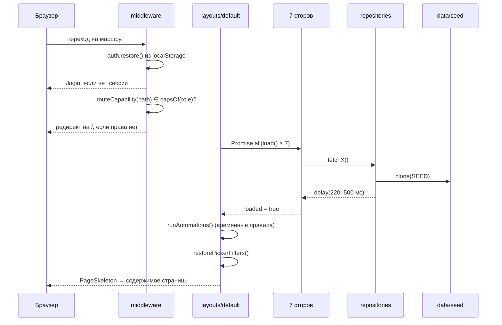

Пока `ready === false`, layout показывает `PageSkeleton` трёх форм
(`dashboard | board | list`) — выбор зависит от маршрута. Переход между
скелетоном и содержимым намеренно **без** `mode="out-in"`: в фоновой вкладке
`requestAnimationFrame` заморожен, и страница залипала на скелетоне до
возвращения фокуса (исправлено в `7019b94`).

---

# 4. Все страницы CRM

32 страницы. Ниже — назначение, URL, компоненты, сторы, данные и действия.
Колонка «Право» — `Capability` из `utils/access.ts`, без которого маршрут
закрыт глобальным middleware.

## 4.1 Карта маршрутов и меню

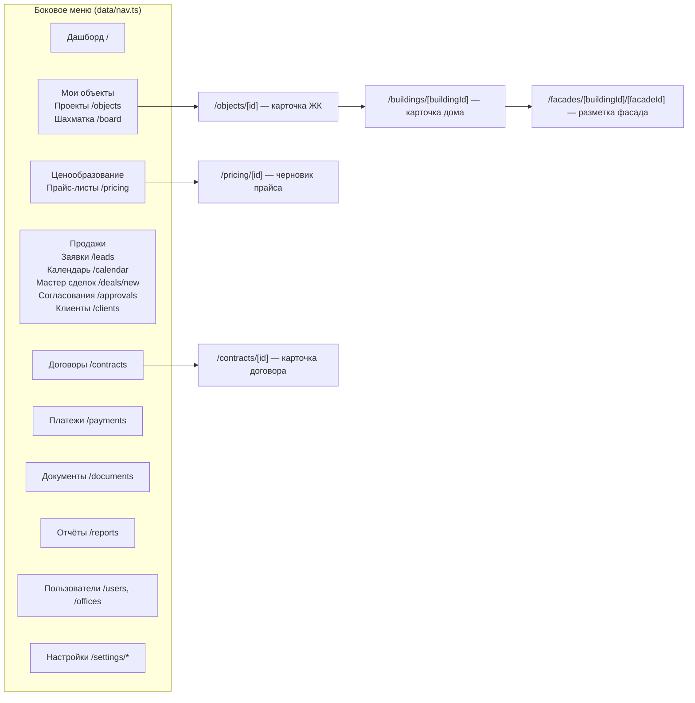

Пункт меню скрыт, если у роли нет права (`AppSidebar` фильтрует `NAV`), и тот
же `Capability` закрывает маршрут — обойти пункт прямой ссылкой нельзя.

## 4.2 Дашборд — операционный центр

| | |
|---|---|
| **URL** | `/` |
| **Файл** | `pages/index.vue` (268 строк) |
| **Право** | нет (доступен всем авторизованным) |
| **Назначение** | ответить на вопрос «что делать сегодня», а не «как шли дела в мае» |
| **Сторы** | `sales`, `deals`, `units`, `approvals`, `auth`, `ui` |
| **Composables** | `useAccess`, `useAgenda` |
| **Компоненты** | `PageHeader`, `DayKpis`, `AgendaList`/`AgendaRow`, `AppCard`, `SegmentedControl`, `SectionHeader`, `CompanyAnalytics` |

**Данные на экране**

1. `DayKpis` — 6 показателей, **набор зависит от рабочего места**:
   * `finance`: дел на сегодня, платежи сегодня (сумма), поступило сегодня, на подтверждении, просрочка, договоров за месяц;
   * `exec` (`dashboard.company`): + просрочка, заявки в работе, выручка в работе;
   * `sales`: дел на сегодня, показы сегодня, просроченные задачи, брони на исходе, мои заявки, мои сделки за месяц.
2. «План на сегодня» — `useAgenda(startOfDay, +1 день)` с фильтром
   Всё/Показы/Звонки/Платежи/Договоры.
3. «Требует внимания» — скидки на согласовании, платежи на подтверждении,
   истекающие брони, заявки без следующего шага (пункты скрываются по правам).
4. «Просрочки» — договоры с `balance.overdueAmount > 0` + просроченные задачи.
5. «Платежи сегодня» (только с `payments.view`), «Показы сегодня».
6. `CompanyAnalytics` — только с правом `dashboard.company`.

**Действия:** закрыть задачу прямо из ленты (`completeLeadTask`), перейти в
объект события, кнопки «Календарь», «Шахматка», «Новая сделка».

## 4.3 Мои объекты

### `/objects` — портфель проектов

| | |
|---|---|
| **Файл** | `pages/objects/index.vue` (263) · **Право** `objects.view` |
| **Сторы** | `units`, `ui` |
| **Компоненты** | `PageHeader`, `MetricStrip`, `Tabs`, `SegmentedControl`, `ShareBar`, `ProjectEditPanel`, `EmptyState` |
| **Данные** | список ЖК: структура фонда (`projectStats`), домов, помещений, свободно, цена м², реализация (%), готовность данных, выручка |
| **Действия** | переключение Активные/Архив, вид Таблица/Карточки, переход в шахматку; архивирование и создание/редактирование проекта — только с `objects.edit` |

### `/objects/[id]` — карточка ЖК

| | |
|---|---|
| **Файл** | `pages/objects/[id].vue` (136) · **Право** `objects.view` |
| **Сторы** | `units`, `deals`, `settings` |
| **Компоненты** | `ProjectHeader`, `ShareBar`, `MediaGallery`, `BuildingFillCard`, `SectionHeader`, `ProjectEditPanel`, `BuildingEditPanel` |
| **Данные** | шапка-витрина (обложка, адрес, стадия, банки) + строка из 6 KPI и спарклайн продаж за 12 месяцев; структура фонда; паспорт проекта (10 полей); генпланы; карточки домов; медиа |
| **Действия** | Генплан / Шахматка / переход в дом — всем; «Новый дом», «Редактировать», загрузка генплана и медиа — только с `objects.edit`; вместо выручки продавец видит свободный фонд |

### `/buildings/[buildingId]` — карточка дома

| | |
|---|---|
| **Файл** | `pages/buildings/[buildingId].vue` (173) · **Право** `objects.view` |
| **Сторы** | `units`, `settings`, `ui` |
| **Компоненты** | `BuildingHeader`, `BuildingSectionCards`, `Tabs`, `ManualBoardEditor`, `ImportUnitsWizard`, `UnitTypePresetsEditor`, `FloorPlansEditor`, `FacadesEditor`, `MediaGallery`, `BuildingEditPanel` |
| **Вкладки** | Обзор (19 полей паспорта + готовность к показу + обложка PDF), Шахматка (ручной редактор по этажам / импорт из Excel), Планировки помещений, Планировки этажей, Фасады |
| **Данные** | `sectionFill()` — честный процент заполнения каждого раздела по фактическим данным |
| **Действия** | с `objects.edit` — правка дома, архив, добавление/импорт помещений, планировки, планы этажей, фасады; без права остаётся одна вкладка «Обзор» в режиме чтения (карточки разделов и загрузка обложки скрыты) |

### `/facades/[buildingId]/[facadeId]` — разметка фасада

| | |
|---|---|
| **Файл** | `pages/facades/[buildingId]/[facadeId].vue` (227) · **Право** `objects.edit` |
| **Сторы** | `units`, `ui` |
| **Компоненты** | `ImageZoneEditor` (600 строк — рисование/правка полигонов), `StatusTag`, `Chip` |
| **Данные** | два режима разметки: `floor:<n>` (полосы этажей + цвет/подпись `FacadeMark`) и `unit:<id>` (контуры помещений) — оба живут в одном массиве `FacadeView.zones`, различаются префиксом `refId` |
| **Действия** | рисовать прямоугольник/полигон, двигать, удалять, привязывать к этажу/помещению, публиковать ракурс |

## 4.4 Ценообразование

### `/pricing` — прайс-листы

| | |
|---|---|
| **Файл** | `pages/pricing/index.vue` (65) · **Право** `pricing.view` |
| **Сторы** | `pricing`, `units`, `ui`, `auth` |
| **Данные** | черновики и опубликованные прайсы текущего проекта (`ui.currentProjectId`) |
| **Действия** | создать черновик → переход в `/pricing/[id]` |

### `/pricing/[id]` — черновик изменения цен

| | |
|---|---|
| **Файл** | `pages/pricing/[id].vue` (161) · **Право** `pricing.view` |
| **Данные** | вкладка «Выбор» (фильтр по дому/номеру, множественный выбор) и «Изменения» (список `PriceChangeItem`: старая → новая цена) |
| **Действия** | массовое изменение на % , правка цены построчно, удаление строки, **публикация** (`pricing.publish()` → `units.applyPriceItems()`) |
| **Ограничение** | публикация меняет `price`, но **не** `basePrice`; ролевой проверки внутри страницы нет — её закрывает только маршрут |

## 4.5 Продажи

### `/leads` — воронка заявок

| | |
|---|---|
| **Файл** | `pages/leads/index.vue` (297) · **Право** `leads.work` |
| **Сторы** | `sales`, `settings`, `misc`, `auth`, `ui` · **Composables** `useAccess`, `useLeadDnd` |
| **Компоненты** | `LeadColumn`, `LeadCard`, `LeadTable`, `LeadDrawer`, `Tabs`, `Chip`, `AppModal` |
| **Данные** | 5 колонок воронки (`LEAD_PIPELINE`) + «Отказ»; в шапке колонки — количество и сумма бюджетов; карточка красится по состоянию задачи (`taskState`: просрочена/сегодня/запланирована/нет) |
| **Фильтры** | мои, ответственный, источник, тег, состояние задачи, поиск по имени/телефону/тегу |
| **Действия** | drag-n-drop между этапами, создание заявки, открытие карточки (`LeadDrawer` — 5 вкладок), переключение доска/таблица, причина отказа |
| **Скоуп ролей** | менеджер видит только свои заявки (`seesEveryone === false`) |

### `/calendar` — календарь продаж

| | |
|---|---|
| **Файл** | `pages/calendar.vue` (179) · **Право** `calendar.view` |
| **Сторы** | `sales`, `settings`, `auth`, `ui` · **Composables** `useAccess`, `useAgenda` |
| **Компоненты** | `CalendarDay` (часовая сетка 08:00–21:00 + линия текущего времени), `CalendarWeek` (7 колонок), `SegmentedControl`, `Chip`, `AppSelect` |
| **Данные** | повестка периода: задачи, показы, встречи, платежи по графику, подписания, истекающие брони; итоги периода (открытых дел, показы, встречи, подписания, сумма платежей) |
| **Действия** | переключение День/Неделя, ←/→ листание, `T` — сегодня, фильтр по типу и менеджеру, закрытие задачи, переход в объект события, клик по числу недели → день |

### `/deals/new` — мастер сделок

| | |
|---|---|
| **Файл** | `pages/deals/new.vue` (233) · **Право** `deals.create` |
| **Сторы** | `units`, `sales`, `settings`, `deals`, `approvals`, `misc`, `auth`, `ui` |
| **Компоненты** | `StepsHeader`, `UnitPicker`, `AppInput`, `AppSelect`, `AppCard` |
| **Шаги** | 1) Объект (тот же `UnitPicker`, скоуп `deal` или `lead:<id>`), 2) Клиент (поиск существующего или новый), 3) Условия (способ оплаты, тип сделки, скидка, срок, первый взнос, маршрут оформления), 4) Договор |
| **Логика** | согласованная скидка подставляется автоматически (`approvals.approvedPercentForLead`); `needsApproval` = скидка выше согласованной ∨ бартер ∨ залог → договор создаётся в статусе `pending_approval` |
| **Результат** | `deals.createContract()` → договор + график платежей + статусы помещений + перевод заявки в «Сделку» + событие автоматизации `contract.signed` |

### `/approvals` — согласование скидок

| | |
|---|---|
| **Файл** | `pages/approvals.vue` (172) · **Право** `approvals.view` |
| **Сторы** | `approvals`, `sales`, `units`, `settings`, `misc`, `auth`, `ui` |
| **Данные** | запросы скидок с маршрутом шагов; фильтры «мои / ждут решения / все»; `approvalRoleOf(role)` определяет, чьи шаги считать «моими» |
| **Действия** | одобрить / отклонить с комментарием (`approvals.decide`), отозвать запрос; решения пишутся в `misc.log` |
| **Ограничение** | право на решение (`approvals.decide`) в матрице есть, но страница проверяет только `approvalRoleOf` — менеджер видит свои запросы и не может решать чужие, так как его роль не совпадает с текущим шагом |

### `/clients` — реестр покупателей

| | |
|---|---|
| **Файл** | `pages/clients/index.vue` (298) · **Право** `clients.view` |
| **Composables** | `useClientProfiles`, `useContextMenu` |
| **Компоненты** | `MetricStrip`, `ClientFilterBar`, `ClientsTable`, `ClientDrawer`, `UnitDrawer`, `ContextMenu`, `AppModal` |
| **Данные** | 13 колонок (клиент, телефон, ЖК, объекты, менеджер, договор, статус, сумма, оплачено, остаток, след. платёж, просрочка, дата покупки, последняя активность), KPI сверху (объём покупок, оплачено, остаток, с просрочкой, VIP) |
| **Действия** | сортировка, показ/скрытие колонок (сохраняется), ширины колонок (сохраняются), фильтры (13 условий), массовое выделение, экспорт в Excel, правый клик → позвонить/WhatsApp/договор/помещение/выгрузить строку, создание клиента, открытие досье (6 вкладок) |

## 4.6 Фонд и подбор

### `/board` — шахматка (подбор помещений)

| | |
|---|---|
| **Файл** | `pages/board.vue` (87) · **Право** `board.view` |
| **Сторы** | `board`, `units`, `sales`, `ui` · **Composable** `useAccess` |
| **Компоненты** | `UnitPicker` (391) — весь подбор, `UnitDrawer` (491) — карточка помещения |
| **Query-параметры** | `?project=`, `?building=`, `?view=master|board|facade|floor|list`, `?floor=`, `?unit=` |
| **Данные** | 5 представлений одного набора помещений, единый фильтр и выделение (раздел 12) |
| **Действия** | выбор дома/ракурса/этажа, фильтры, выделение (Ctrl+клик), массовая смена статуса и цены (по правам), сравнение, экспорт, бронь (B), договор (D), очередь |

## 4.7 Договоры, платежи, документы, отчёты

### `/contracts` — реестр договоров

| | |
|---|---|
| **Файл** | `pages/contracts/index.vue` (134) · **Право** `contracts.view` |
| **Данные** | № договора, клиент, объект, тип сделки, сумма, долг (`balance.overdueAmount`), статус, дата |
| **UX** | липкая шапка, изменяемые ширины колонок, клавиатура, контекстное меню (открыть/клиент/помещение/позвонить/копировать номер) |
| **Скоуп** | менеджер видит договоры своих заявок (`mine()` по `contract.leadId → lead.assignedTo`) |

### `/contracts/[id]` — карточка договора

| | |
|---|---|
| **Файл** | `pages/contracts/[id].vue` (200) · **Право** `contracts.view` |
| **Сторы** | `deals`, `sales`, `units`, `settings`, `misc`, `auth`, `ui` |
| **Вкладки** | состав сделки, график платежей, платежи, документы |
| **Действия** | зарегистрировать платёж (`registerPayment` → статус `pending`), сформировать документ из шаблона (`misc.generateDocument`), просмотр графика и баланса |

### `/payments` — доска оплат

| | |
|---|---|
| **Файл** | `pages/payments/index.vue` (84) · **Право** `payments.view`; подтверждение — `payments.confirm` |
| **Данные** | активные договоры, разложенные по срокам ближайшего платежа (`paymentBoardBucket`: `soon / today / d1_7 / d8_30 / d30_plus`), очередь платежей на подтверждении |
| **Действия** | подтвердить / отклонить платёж (только с правом), переход в договор |

### `/documents` — сформированные документы

| | |
|---|---|
| **Файл** | `pages/documents/index.vue` (50) · **Право** `documents.view` · **Стор** `misc` |
| **Данные** | журнал `GeneratedDocument` (4 записи из сида + созданные в сессии): шаблон, процесс, договор, клиент, автор, дата |
| **Действия** | поиск, фильтр по процессу, переход к шаблонам |
| **Ограничение** | сам файл не генерируется — **не реализовано**, запись журнала создаётся без содержимого |

### `/reports` — аналитика

| | |
|---|---|
| **Файл** | `pages/reports/index.vue` (83) · **Право** `analytics.view` |
| **Данные** | поступления за 6 месяцев, менеджеры (заявки → сделки, конверсия), проекты |
| **Замечание** | берёт список менеджеров напрямую из `data/catalog` (`USERS`), а не из `settingsStore.users` — пользователи, созданные в UI, в отчёт не попадут (долг H-10) |

## 4.8 Пользователи и настройки

| URL | Файл | Право | Содержание |
|---|---|---|---|
| `/users` | `users/index.vue` (94) | `users.manage` | список сотрудников, роль, статус активности, приглашение пользователя, **статическая** матрица прав (текст, 10 строк) |
| `/offices` | `offices/index.vue` (54) | `users.manage` | офисы продаж, привязка к проектам, создание офиса |
| `/settings` | `settings/index.vue` (29) | `settings.manage` | плитки разделов по группам (`SETTINGS_NAV`) |
| `/settings/templates` | (130) | `settings.manage` | шаблоны документов + переменные подстановки |
| `/settings/numerators` | (28) | `settings.manage` | форматы номеров документов (только отображение формата) |
| `/settings/payment-methods` | (55) | `settings.manage` | способы оплаты: тип, публичность, влияние на цену |
| `/settings/promotions` | (56) | `settings.manage` | акции: область действия, процент/сумма, активность |
| `/settings/options` | (46) | `settings.manage` | опции помещений (кладовая, паркинг и т.п.) |
| `/settings/statuses` | (58) | `settings.manage` | справочник статусов (отображение) |
| `/settings/calculator` | (37) | `settings.manage` | включение калькулятора условий покупки |
| `/settings/deal-settings` | (51) | `settings.manage` | порядок применения скидок, обязательные поля клиента и представителя |
| `/settings/automations` | (278) | `settings.manage` | **конструктор автоматизаций** (раздел 11): правила, шаблоны сценариев, журнал, очередь брони, лимиты скидок |
| `/settings/account` | (43) | `settings.manage` | страна, валюта аккаунта |

## 4.9 Вход

| | |
|---|---|
| **URL** | `/login` · layout `auth` · **Файл** `pages/login.vue` (75) |
| **Поток** | телефон → код (демо-код `0000`, **принимается любой**) → `AppUser` из `data/catalog` |
| **Демо-вход** | чипы с 6 ролями подставляют телефон |
| **Критично** | если телефон не найден, `verifyCode` возвращает `USERS[0]` — **директора** (долг C-2) |

---

# 5. Роли пользователей

## 5.1 Модель доступа

Право — это **возможность** (`Capability`), а не страница. Одна возможность
закрывает три места одновременно: пункт меню (`AppSidebar` фильтрует `NAV`),
маршрут (`middleware/access.global.ts` через `routeCapability`) и кнопку внутри
экрана (`useAccess().can()`).

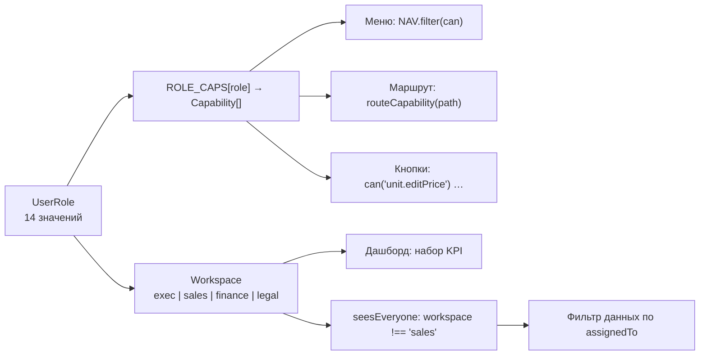

**23 возможности:** `dashboard.company`, `board.view`, `unit.editStatus`,
`unit.editPrice`, `objects.view`, `objects.edit`, `pricing.view`, `pricing.edit`,
`leads.viewAll`, `leads.work`, `deals.create`, `approvals.view`,
`approvals.decide`, `clients.view`, `contracts.view`, `payments.view`,
`payments.confirm`, `documents.view`, `analytics.view`, `calendar.view`,
`users.manage`, `settings.manage`, `audit.view`.

## 5.2 Матрица ролей (факт из `ROLE_CAPS`)

Сокращения: **D** dashboard.company, **B** board.view, **US** unit.editStatus,
**UP** unit.editPrice, **OV** objects.view, **OE** objects.edit, **PV** pricing.view,
**PE** pricing.edit, **LA** leads.viewAll, **LW** leads.work, **DC** deals.create,
**AV** approvals.view, **AD** approvals.decide, **CL** clients.view, **CT** contracts.view,
**PY** payments.view, **PC** payments.confirm, **DO** documents.view, **AN** analytics.view,
**CA** calendar.view, **UM** users.manage, **SM** settings.manage, **AU** audit.view.

| Роль (`UserRole`) | Рабочее место | D | B | US | UP | OV | OE | PV | PE | LA | LW | DC | AV | AD | CL | CT | PY | PC | DO | AN | CA | UM | SM | AU |
|---|---|:-:|:-:|:-:|:-:|:-:|:-:|:-:|:-:|:-:|:-:|:-:|:-:|:-:|:-:|:-:|:-:|:-:|:-:|:-:|:-:|:-:|:-:|:-:|
| `admin` | exec | ✅|✅|✅|✅|✅|✅|✅|✅|✅|✅|✅|✅|✅|✅|✅|✅|✅|✅|✅|✅|✅|✅|✅ |
| `director` | exec | ✅|✅|✅|✅|✅|✅|✅|✅|✅|✅|✅|✅|✅|✅|✅|✅|✅|✅|✅|✅|✅|✅|✅ |
| `commercial_director` | exec | ✅|✅|✅|✅|✅|✅|✅|✅|✅|✅|✅|✅|✅|✅|✅|✅|✅|✅|✅|✅|❌|✅|✅ |
| `partner` | exec | ✅|✅|❌|❌|✅|❌|❌|❌|❌|❌|❌|❌|❌|❌|✅|✅|❌|❌|✅|❌|❌|❌|❌ |
| `auditor` | exec | ✅|✅|❌|❌|✅|❌|❌|❌|❌|❌|❌|❌|❌|✅|✅|✅|❌|✅|✅|❌|❌|❌|✅ |
| `manager` | sales | ❌|✅|❌|❌|✅|❌|❌|❌|❌|✅|✅|✅|❌|✅|✅|✅|❌|✅|❌|✅|❌|❌|❌ |
| `care_manager` | sales | ❌|✅|❌|❌|✅|❌|❌|❌|✅|✅|✅|✅|❌|✅|✅|✅|❌|✅|❌|✅|❌|❌|❌ |
| `agent` | sales | ❌|✅|❌|❌|✅|❌|❌|❌|❌|✅|❌|❌|❌|✅|❌|❌|❌|❌|❌|✅|❌|❌|❌ |
| `finance_director` | finance | ✅|✅|❌|❌|✅|❌|✅|❌|❌|❌|❌|✅|✅|✅|✅|✅|✅|✅|✅|✅|❌|❌|✅ |
| `accountant` | finance | ❌|✅|❌|❌|✅|❌|❌|❌|❌|❌|❌|❌|❌|✅|✅|✅|✅|✅|✅|✅|❌|❌|✅ |
| `head_cashier` | finance | ❌|✅|❌|❌|✅|❌|❌|❌|❌|❌|❌|❌|❌|✅|✅|✅|✅|✅|✅|✅|❌|❌|✅ |
| `cashier` | finance | ❌|✅|❌|❌|✅|❌|❌|❌|❌|❌|❌|❌|❌|✅|✅|✅|✅|❌|❌|✅|❌|❌|❌ |
| `controller` | finance | ❌|✅|❌|❌|✅|❌|❌|❌|❌|❌|❌|✅|❌|✅|✅|✅|❌|✅|✅|✅|❌|❌|✅ |
| `lawyer` | legal | ❌|✅|❌|❌|✅|❌|❌|❌|❌|❌|❌|❌|❌|✅|✅|❌|❌|✅|❌|✅|❌|❌|✅ |

## 5.3 Что видит и что может каждая роль

### Директор / Администратор (`exec`)
* **Видит:** всё. Дашборд с KPI дня **и** блоком «Аналитика компании»
  (динамика 12 месяцев, план/факт, воронка, структура фонда, доска оплат,
  продажи по ЖК/менеджерам/источникам, журнал, последние договоры).
* **Может:** менять статусы и цены помещений, вести прайс-листы, решать по
  скидкам, подтверждать платежи, управлять пользователями и настройками.
* **Ограничения:** у `commercial_director` нет `users.manage`.

### Менеджер продаж (`manager`)
* **Видит:** свой день (KPI: дел на сегодня, показы, просроченные задачи, брони
  на исходе, мои заявки, мои сделки за месяц), **только свои** заявки, клиентов,
  договоры и платежи своих клиентов. Меню: Проекты, Шахматка, Заявки, Календарь,
  Мастер сделок, Согласования, Клиенты, Договоры, Доска оплат, Документы.
* **Может:** вести заявки, бронировать, оформлять договоры, запрашивать скидку.
* **Не может:** править каталог вообще (`unit.editStatus` и `objects.edit` у
  него нет): ни цену, ни планировку, ни статус помещения вручную — статус
  меняется сам через бронь, договор и истечение срока. Также недоступны
  выручка компании и аналитика, прайс, подтверждение платежей, настройки,
  пользователи и разметка фасадов.
* **Видит вместо денег компании:** на карточке проекта и в списке объектов
  место «Выручки в работе» занимает размер свободного фонда
  (`seesMoney = can('dashboard.company')`).

### Куратор ОРК (`care_manager`)
Права менеджера + `leads.viewAll` (видит чужие заявки). Отдельного экрана для
роли нет — **UI под неё не отличается**, кроме объёма данных.

### Агент (`agent`)
Минимальный набор: шахматка, объекты, заявки, клиенты, календарь. Не создаёт
договоры, не видит платежи и документы. По матрице из `/users` агент «не видит
покупателей» — **в коде это не реализовано**, ограничение только на уровне
списка возможностей.

### Финансовый директор / Бухгалтер / Заведующий кассой (`finance`)
* **Видит:** дашборд с финансовыми KPI (платежи сегодня, поступило сегодня, на
  подтверждении, просрочка, договоров за месяц), доску оплат, договоры, клиентов,
  аналитику, журнал действий.
* **Может:** подтверждать и отклонять платежи. Финдиректор дополнительно видит
  дашборд компании, прайс (просмотр) и решает по скидкам.
* **Не может:** вести заявки (маршрут `/leads` закрыт), менять фонд.

### Кассир (`cashier`)
Урезанный финансовый набор: без аналитики, документов и журнала.

### Контролёр (`controller`)
Финансовый набор + просмотр согласований, без подтверждения платежей.

### Юрист (`lawyer`)
Договоры, документы, клиенты, объекты, календарь, журнал действий. Без
платежей, заявок и настроек.

### Партнёр / Аудитор (`exec`, read-only)
`dashboard.company` + просмотр договоров, платежей, объектов, аналитики
(аудитор — ещё клиентов, документов и журнала). Ни одного права на запись.
**Отдельного «портала инвестора» нет** — они видят тот же дашборд, часть блоков
которого для них пустая (нет `leads.work` → лента дня почти всегда пуста).

## 5.4 Как реализован скоуп «своё / всё»

```ts
// composables/useAccess.ts
seesEveryone = workspace !== 'sales' || caps.has('leads.viewAll')
```

| Экран | Как режется |
|---|---|
| `/leads` | `filtered` отбрасывает заявки с чужим `assignedTo` |
| `/clients` | `useClientProfiles` отдаёт профили, где менеджер клиента = я или есть моя заявка |
| `/contracts` | локальная `mine()` по `contract.leadId → lead.assignedTo` |
| `/payments` | локальная `mine()` (та же логика, свой экземпляр) |
| Дашборд | `useAgenda` фильтрует повестку по `assignedTo`, просрочки — по владельцу договора |
| `/calendar` | `useAgenda` + селектор менеджера (только для `seesEveryone`) |
| `/objects`, `/objects/[id]`, `/buildings/[id]` | `can('objects.edit')` прячет создание/правку/загрузку медиа и вкладки наполнения; `can('dashboard.company')` — выручку |

**Слабое место:** одна и та же логика записана четырьмя разными способами, а
готовая `useAccess().mine()` не используется нигде (долг H-9).

## 5.5 Чего в ролевой модели нет

| Требование | Статус |
|---|---|
| Ограничение по проектам (`AppUser.projectIds` есть в модели) | **не реализовано** — поле не используется ни в одном фильтре |
| Права на уровне полей (маска паспорта для менеджера) | **не реализовано** — `passportMasked` приходит замаскированным всем |
| Серверная проверка прав | **не реализовано** (бэкенда нет) |
| Редактирование ролей/прав в UI | **не реализовано** — `/users` меняет только активность; матрица прав на странице статична |
| Журнал доступа (кто что открывал) | **не реализовано**; есть журнал действий (`misc.audit`) |

---

# 6. Бизнес-flow

## 6.1 Полный путь клиента

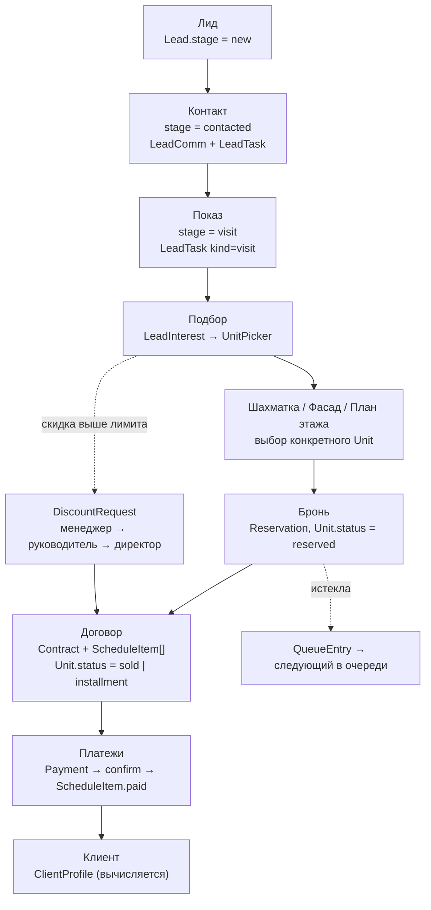

## 6.2 Этапы в деталях

### Этап 1. Лид
| | |
|---|---|
| **Сущности** | `Lead` (+ `Client`), `LeadEvent` `created` |
| **Сторы** | `sales.createLead()` |
| **Компоненты** | `/leads` → модалка создания, `LeadColumn`, `LeadCard` |
| **Автоматизация** | `fire('lead.created')` → встроенное правило «Первый звонок по новой заявке» ставит `LeadTask` через 24 ч |
| **Данные** | источник, канал, бюджет, приоритет, теги, ответственный |

### Этап 2. Контакт
| | |
|---|---|
| **Сущности** | `LeadComm` (звонок/WhatsApp/встреча), `LeadTask`, `LeadEvent` |
| **Сторы** | `sales.addComm()`, `sales.addLeadTask()`, `sales.completeLeadTask()` |
| **Компоненты** | `LeadDrawer` → `LeadNextAction`, `TaskComposer`, `LeadTimeline` |
| **Автоматизация** | `lead.stalled` (правило «Заявка застряла на этапе», порог 5 дней) |

### Этап 3. Показ
| | |
|---|---|
| **Сущности** | `LeadTask` c `kind: 'visit'` |
| **Сторы** | `sales.completeLeadTask()` → `fire('visit.completed')` |
| **Компоненты** | Календарь (`CalendarDay`), лента дня на дашборде |
| **Автоматизация** | «Follow-up после показа»: задача-звонок через 24 ч |

### Этап 4. Подбор
| | |
|---|---|
| **Сущности** | `LeadInterest` (структурированный запрос) |
| **Сторы** | `sales.setLeadInterest()`, `board.applyInterest()` |
| **Утили** | `useLeadMatching.matchUnits()` / `scoreUnit()` — 0..100 с разбором «почему не подошло» |
| **Компоненты** | `LeadInterestBlock`, `LeadMatchingUnits`, `UnitPicker` (скоуп `lead:<id>`) |

### Этап 5–6. Шахматка → Фасад
| | |
|---|---|
| **Сущности** | `Project` → `Building` → `Unit`, `ImageZone` (разметка фасада/этажа/генплана) |
| **Сторы** | `units`, `board` (фильтр, выделение, режим) |
| **Компоненты** | `UnitPicker` → `UnitMasterPlanView` / `UnitBoardGrid` / `UnitFacadeView` / `UnitFloorPlanView` / `UnitListTable` |
| **Особенность** | выделение и фильтр общие для всех пяти представлений (раздел 12) |

### Этап 7. Бронь
| | |
|---|---|
| **Сущности** | `Reservation` (`no_deposit` 1 день / `confirmed` 3 дня / `with_deposit` 30 дней), `Unit.status = reserved`, `Unit.reservationId` |
| **Сторы** | `sales.reserveUnit()` (общая) и `sales.reserveFromLead()` (со связью и переводом заявки на этап «Бронь») |
| **Компоненты** | `UnitDrawer` → вкладка «Сделка», `ReserveComposer`, `UnitMiniCard`, `UnitSelectionBar` (горячая клавиша **B**) |
| **Автоматизации** | `reservation.created`; по времени — `reservation.expiring` (за 24 ч) и `reservation.expired` (снятие брони, предложение очереди, уведомление) |
| **Очередь** | `QueueEntry` + `units.offerToNextInQueue()` — следующий получает бронь без задатка на сутки |

### Этап 8. Договор
| | |
|---|---|
| **Сущности** | `Contract`, `ScheduleItem[]`, `Unit.contractId`, `Reservation.status = converted`, `Lead.stage = deal` |
| **Сторы** | `deals.createContract()` |
| **Компоненты** | `/deals/new` (4 шага), `UnitDealCard`, `/contracts/[id]` |
| **Согласование** | скидка выше лимита → `DiscountRequest`; договор создаётся в `pending_approval` при бартере, залоге или несогласованной скидке |
| **Автоматизация** | `contract.signed` → уведомление финансам (встроенное правило) |

### Этап 9. Платежи
| | |
|---|---|
| **Сущности** | `Payment` (`pending → confirmed / rejected`), `ScheduleItem.paid` |
| **Сторы** | `deals.registerPayment()`, `deals.confirmPayment()` (разносит сумму по графику FIFO), `deals.balance()` |
| **Компоненты** | `/payments` (доска по срокам), `ClientFinance` («Добавить оплату»), `/contracts/[id]` |
| **Автоматизация** | `payment.overdue` (по времени, порог в днях) → уведомление руководителю |

### Этап 10. Клиент
| | |
|---|---|
| **Сущности** | `Client` + **вычисляемый** `ClientProfile` |
| **Утиль** | `utils/clientProfile.ts` — статус, суммы, график, LTV, средний чек, просрочки |
| **Компоненты** | `/clients`, `ClientDrawer` (6 вкладок), `ClientDossier` (печать) |

## 6.3 Что запускает автоматизации

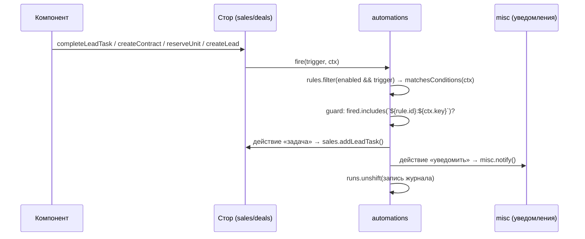

Временные правила (`reservation.expiring`, `reservation.expired`,
`payment.overdue`, `lead.stalled`) не имеют планировщика: они выполняются
**при входе в приложение** — `layouts/default.vue` → `runAutomations()` →
`automations.runTimed()`.

---

# 7. Сущности системы

## 7.1 ER-диаграмма

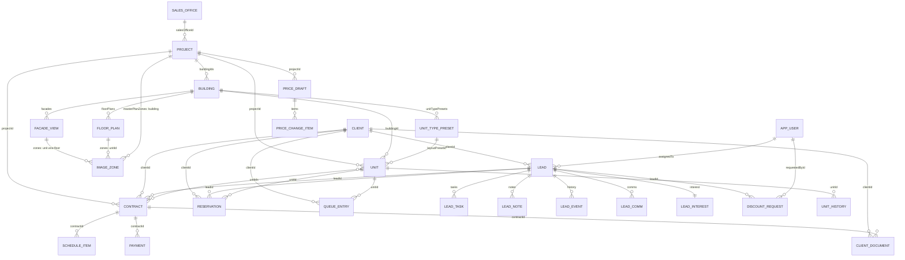

**Ключевая особенность модели:** между `Unit` и `Contract` связь
«многие-ко-многим» через массив `Contract.unitIds` (квартира + паркинг + кладовая
в одном договоре), а обратная ссылка денормализована в `Unit.contractId` —
на неё опираются шахматка и карточка помещения.

## 7.2 Фонд

### `Project` (ЖК)
| Поле | Тип | Комментарий |
|---|---|---|
| `id`, `name`, `propertyKind` | string, `residential\|commercial\|mixed` | |
| `address`, `developer`, `country`, `stage`, `salesStart` | string | паспорт |
| `banks` | `string[]` | банки-партнёры, попадают в фильтры клиентов |
| `currency` | `'USD' \| 'KGS'` | валюта проекта |
| `infrastructure`, `website`, `salesOfficeId` | string | витрина |
| `buildingIds` | `string[]` | денормализованный список домов |
| `accent` | string | цвет проекта во всём интерфейсе |
| `archived` | boolean | |
| `media`, `masterPlans` | `MediaAsset[]` | фото/видео и генпланы |
| `masterPlanZones` | `ImageZone[]` | контуры домов, `refId = building:<id>` |

**Создаёт:** `units.createProject()` (форма `ProjectEditPanel`).
**Меняет:** `units.updateProject()`, `toggleProjectArchive()`, медиа-экшены.
**Жизненный цикл:** черновик → продажи → архив (флаг).

### `Building` (дом)
34 поля: идентификация (`projectId`, `name`, `badge`), тип (`defaultUnitKind`,
`structureType`), стройка (`constructionStage`, `constructionStart/End`,
`deliveryDate`), продажи (`salesStart/End`, `salesOfficeId`), конструктив
(`sections`, `floors`, `floorsBelow`, лифты, мусоропровод, шоурум), маркетинг
(`slogan`, `pdfImageUrl`), контент (`facades[]`, `facadeMarks[]`,
`unitTypePresets[]`, `floorPlans[]`) и `fill` — 5 флагов заполненности.

**Создаёт:** `units.createBuilding()`. **Меняет:** `updateBuilding`, редакторы
фасадов/планировок/планов, импорт помещений (ставит `fill.board = true`).

### `Unit` (помещение)
| Поле | Тип | Роль |
|---|---|---|
| `id`, `number` | string | `id` = `<buildingId>-<number>` в сиде |
| `buildingId`, `projectId` | string | денормализация ради фильтров |
| `section`, `floor` | number | паркинг/кладовые: `section = 0`, `floor = -1` |
| `kind` | `apartment\|commercial\|parking\|storage\|cottage\|townhouse\|land` | реализованы первые четыре |
| `rooms`, `area` | number | |
| `status` | `free\|reserved\|installment\|sold\|closed` | **центральное поле системы** |
| `price`, `basePrice` | number | цена и база для скидок/прайса |
| `finishing` | `none\|rough\|fine\|furnished` | |
| `reservationId`, `contractId` | string? | обратные ссылки |
| `layoutPresetId`, `imageUrl` | string? | планировка-тип и свой файл |
| `explication`, `roomZones` | массивы? | своя ведомость комнат и её разметка |
| `keysIssued`, `layoutName` | | |

**Переходы статуса:**

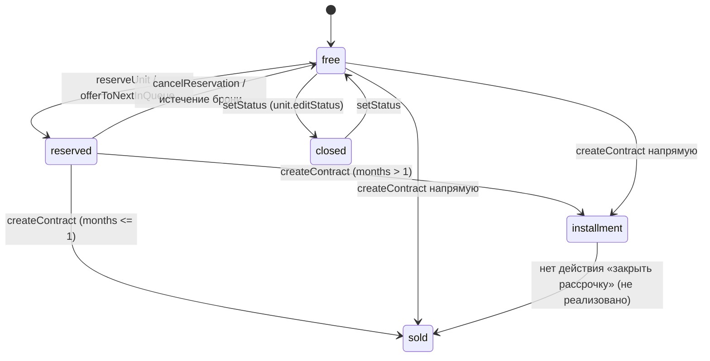

Массовые операции (`bulkSetStatus`, `bulkSetPrice`) **пропускают** помещения под
договором — это защита от рассинхрона с финансами.

## 7.3 Продажи

### `Client`
`kind` (физлицо/юрлицо), `name`, `phone`, `whatsapp`, `email`, `origin`
(`own/partner/reassignment`), `inn`, `passportMasked`, `birthDate`, `address`,
`maritalStatus`, `source`, `vip`, `note`, `createdAt`.
**Создаёт:** `sales.addClient()` — из реестра клиентов, мастера сделок и формы
брони в карточке помещения. **Удаления нет.**

### `Lead` (заявка)
| Группа | Поля |
|---|---|
| Идентификация | `id`, `clientId`, `assignedTo`, `createdAt` |
| Воронка | `stage`, `stageSince`, `priority`, `tags`, `budget` |
| Источник | `channel`, `source` |
| Работа | `tasks[]`, `notes[]`, `comms[]`, `history[]`, `lastContactAt` |
| Подбор | `interest: LeadInterest`, `interestedUnitIds[]` |
| Итог | `lostReason`, `lostAt`, устаревшие `nextAction`/`nextAt` |

**Жизненный цикл:** `new → contacted → visit → reserved → deal` либо `lost`.
Переход выполняет `sales.moveLead()` (двигает `stageSince` и пишет `LeadEvent`).
Договор переводит заявку в `deal` автоматически.

### `LeadTask` / `LeadComm` / `LeadNote` / `LeadEvent`
Вложены в `Lead` (не отдельные коллекции). `LeadTask` — единственный источник
«что делать»: по нему красится карточка (`taskState`), строится повестка дня и
календарь. Создают: менеджер (`TaskComposer`) и автоматизации.

### `Reservation`
`unitId`, `clientId`, `leadId?`, `kind`, `deposit`, `createdAt`, `expiresAt`,
`status` (`active → converted | expired | cancelled`), `createdBy`.
Срок: 1 / 3 / 30 дней по виду брони (`RESERVATION_KIND_META`).

### `QueueEntry`
Очередь интересантов на занятое помещение: `unitId`, `clientId`, `name`,
`phone`, `addedAt`. Плоский массив в `units.queue`, порядок = порядок добавления.

## 7.4 Деньги

### `Contract`
`number` (`Д-<год>-<4 цифры>`), `projectId`, `clientId`, `unitIds[]`, `dealType`
(`regular/barter/barter_land/pledge/preferential`), `status`
(`draft/pending_approval/active/paid/terminated`), `currency`, `price`,
`discount`, `signedAt`, `createdAt`, `route` (`company/notary/state_registry`),
`leadId?`, `managerId?`, `paymentMethodId?`, `bank?`, `agentId?`.

**Создаёт:** только `deals.createContract()`.
**Не реализовано:** расторжение (`terminated`), допсоглашения, смена статуса на
`paid` автоматически при полной оплате.

### `ScheduleItem` (строка графика)
`contractId`, `dueDate`, `amount`, `paid`, `version`. Генерируется вместе с
договором: первый взнос + равные платежи по месяцам. Поле `version` заложено
под реструктуризацию — **механики версий нет**.

### `Payment`
`contractId`, `date`, `amount`, `currency`, `kind` (9 видов), `status`
(`pending → confirmed | rejected`), `receiptNumber`, `note`.
Подтверждение разносит сумму по графику (FIFO) и присваивает номер ПКО.

### `DiscountRequest`
`basePrice`, `percent`, `amount`, `reason`, `requestedBy/ById`, `status`,
`steps: ApprovalStep[]`. Маршрут строится из лимитов
(`settings.discountLimits`: менеджер 3 %, руководитель 7 %, директор 15 %).

### `PriceDraft` + `PriceChangeItem`
Черновик изменения цен по проекту; публикация применяет `newPrice` к `Unit.price`.

## 7.5 Контент и служебные

| Сущность | Где живёт | Комментарий |
|---|---|---|
| `ClientDocument` | `sales.documents` | `url` = blob-ссылка; связи: клиент, заявка, договор; флаг `signed` |
| `MediaAsset` | внутри `Project` | фото/видео/генпланы |
| `ImageZone` | внутри фасада/плана/генплана | нормализованные координаты 0..1, `refId` с префиксом вида |
| `UnitTypePreset` | внутри `Building` | планировка-тип: комнаты, площадь, изображение, экспликация, разметка комнат |
| `ExplicationRoom` | внутри пресета/помещения | ведомость комнат с коэффициентами (балкон 0.5 и т.п.) |
| `UnitHistoryEntry` | `units.unitHistory` | цена/статус/бронь/договор — лента «Активность» карточки |
| `AuditEntry` | `misc.audit` | журнал действий (модуль, текст, автор) |
| `NotificationItem` | `misc.notifications` | колокольчик; ключ детерминированный — повторный прогон не плодит дубли |
| `AutomationRule` / `AutomationRun` | `automations` | раздел 11 |
| `GeneratedDocument` | `misc.generatedDocs` | запись о сформированном документе (самого файла нет) |
| `AppUser`, `SalesOffice`, `Promotion`, `PaymentMethod`, `UnitOption`, `DocumentTemplate`, `TemplateVariable` | `settings` | справочники из `data/catalog` |

## 7.6 Кто создаёт и кто меняет

| Сущность | Создаёт | Меняет | Удаляет |
|---|---|---|---|
| Project | `units.createProject` | `updateProject`, архив | — (архив) |
| Building | `units.createBuilding` | `updateBuilding`, редакторы контента | — (архив) |
| Unit | сид, `addManualUnit`, `importUnits` | `patchUnit`, `setStatus`, `bulkSetStatus/Price`, договор | `removeUnit` |
| Client | `sales.addClient` | прямая мутация полей в UI досье | — |
| Lead | `sales.createLead` | `moveLead`, `patchLead`, задачи/заметки/звонки | `removeLead` |
| Reservation | `reserveUnit`, `reserveFromLead`, `offerUnitToQueue` | `extendReservation`, `cancelReservation`, автоматизации | — |
| Contract | `deals.createContract` | — (изменения статуса **не реализованы**) | — |
| ScheduleItem | `deals.createContract` | `confirmPayment` (поле `paid`) | — |
| Payment | `deals.registerPayment` | `confirmPayment`, `rejectPayment` | — |
| DiscountRequest | `approvals.request` | `decide`, `cancel` | — |
| ClientDocument | `sales.addDocument` | `toggleDocumentSigned`, `setDocumentKind` | `removeDocument` |
| AutomationRule | `builtinRules()`, `saveRule` | `saveRule`, `toggleRule`, `duplicateRule` | `removeRule` (кроме встроенных) |

## 7.7 Объём демо-данных (сид `makeRng(88420)`)

| Сущность | Количество |
|---|---|
| Проекты | 2 (ЖК «Аврора», ЖК «Панорама») |
| Дома | 3 (aurora-1: 9 этажей × 2 секции, aurora-2: 6 × 2, panorama-1) |
| Помещения | 235 (квартиры, коммерция на 1 этаже, паркинг, кладовые) |
| Клиенты | 49 (46 физлиц + 3 юрлица) |
| Заявки | 34 |
| Пользователи | 14 (`data/catalog`) |
| Договоры, графики, платежи, брони, очередь, документы, история, аудит, уведомления, запросы скидок | генерируются вокруг `TODAY` |

`TODAY` — текущая дата в 09:00 локального времени, но не раньше опорной
`2026-09-23` (см. `data/seed.ts`): демо всегда «свежее».

---

# 8. Stores

11 сторов Pinia (Options API). Автоимпорт `useXStore()` — в коде нет ни одного
явного импорта стора в компонентах; внутри сторов импорты **явные и
относительные** (`./units`), чтобы контролировать циклы.

## 8.1 Карта зависимостей

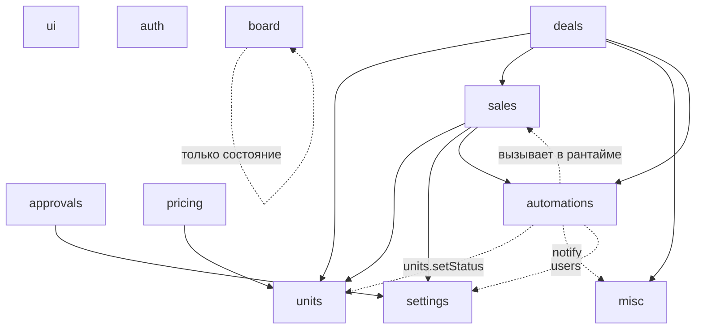

Цикл `sales → automations → sales` разорван тем, что `automations` не импортирует
сторы на уровне модуля: он вызывает `useSalesStore()` **внутри экшенов**.

## 8.2 `units` (527 строк) — фонд

| | |
|---|---|
| **Ответственность** | проекты, дома, помещения, очередь, история помещений, контент дома (фасады, планировки, планы этажей, экспликации) |
| **State** | `projects[]`, `buildings[]`, `units[]`, `queue[]`, `unitHistory[]`, `loaded`, `loading` |
| **Getters** | `project/building/unit(id)`, `buildingsByProject`, `unitsByBuilding`, `unitsByProject`, `queueFor`, `historyFor`, `fillPercent`, `sectionFill` (честный % заполнения разделов), `projectStats`, `buildingStats` |
| **Actions (главные)** | `load`, `setStatus`, `bulkSetStatus`, `bulkSetPrice`, `logUnitChange`, `addToQueue/removeFromQueue/offerToNextInQueue`, `applyPriceItems`, CRUD проекта и дома, `addFacade/updateFacade/setFacadeZones/toggleFacadePublished/moveFacade`, `setFloorPlanImage/Zones`, пресеты планировок, экспликации (`explicationFor`, `setUnitExplication`, `resetUnitExplication`, `fillUnitExplicationFromTemplate`), `roomPlanFor`, `addManualUnit`, `patchUnit`, `removeUnit`, `importUnits` |
| **Зависимости** | `repositories/units`, `utils/explication` |
| **Кто вызывает** | `/board`, `/objects*`, `/buildings/*`, `/facades/*`, `/pricing/*`, дашборд, клиенты, договоры, мастер сделок, `automations` |

Важные инварианты: помещение под договором не меняется массово; любое изменение
цены или статуса пишется в `unitHistory`.

## 8.3 `sales` (483) — заявки, клиенты, брони, документы

| | |
|---|---|
| **State** | `clients[]`, `leads[]`, `reservations[]`, `documents[]` |
| **Getters** | `client/lead(id)`, `leadsByStage`, `reservationForUnit`, `activeReservations`, `openTask`, `taskState`, `stageSummary`, `daysInStage`, `allTags`, `reservationsForLead/Client`, `leadsForClient`, `documentsForLead/Client`, `leadsInterestedInUnit` |
| **Actions** | `load`, `addClient`, `setLeadStage`, `setLeadInterest`, `addComm`, документы (`addDocument`, `toggleDocumentSigned`, `setDocumentKind`, `removeDocument`), брони (`reserveUnit`, `reserveFromLead`, `extendReservation`, `cancelReservation`, `offerUnitToQueue`, `expireReservations`), заявки (`logLead`, `moveLead`, `assignLead`, `patchLead`, `setLeadPriority`, `toggleLeadTag`, `addLeadNote`, задачи `addLeadTask/toggleLeadTask/updateLeadTask/rescheduleLeadTask/completeLeadTask/removeLeadTask`, `syncNextAction`, `toggleLeadUnit`, `createLead`, `removeLead`) |
| **Точки автоматизаций** | `createLead → fire('lead.created')`, `completeLeadTask(visit) → fire('visit.completed')`, `reserveUnit → fire('reservation.created')` |
| **Зависимости** | `units`, `settings`, `automations`, `data/seed.TODAY` |

## 8.4 `deals` (173) — договоры, графики, платежи

| | |
|---|---|
| **State** | `contracts[]`, `scheduleItems[]`, `payments[]` |
| **Getters** | `contract(id)`, `scheduleFor`, `paymentsFor`, `pendingPayments`, `contractsForLead/Client`, **`balance(contractId)`** (цена, оплачено, остаток, просрочка в днях и сумме, ближайший платёж), **`paymentBoardBucket`** (`soon/today/d1_7/d8_30/d30_plus/ok`) |
| **Actions** | `load`, `createContract` (договор + график + статусы помещений + конвертация брони + перевод заявки + уведомление + `fire('contract.signed')`), `registerPayment`, `confirmPayment`, `rejectPayment` |
| **Зависимости** | `units`, `sales`, `misc`, `automations`, `TODAY` |

`balance()` — самый «горячий» геттер: он пересчитывается в реестре клиентов,
на доске оплат, в дашборде и в карточке помещения.

## 8.5 `board` (145) — состояние подбора

| | |
|---|---|
| **Ответственность** | фильтр, выделение, навигация и режимы подбора — **по скоупам** |
| **State** | `scopes: Record<string, PickerScope>` |
| **PickerScope** | `view` (`master/board/facade/floor/list`), `filters`, `buildingId`, `facadeId`, `floor`, `selected[]`, `colorMode` (`status/payment`), `cellSize` (`compact/large`), `scoreLeadId`, `facadeMode` (`sale/edit`) |
| **Ключи скоупов** | `board` (страница шахматки), `lead:<id>` (карточка заявки), `deal` (мастер сделок), `contract:<id>` (допродажа) |
| **Actions** | `ensure`, `setView/Filters/Building/Facade/Floor/ColorMode/CellSize/FacadeMode`, `resetFilters`, выделение (`toggleSelect`, `select`, `selectOnly`, `selectMany`, `deselect`, `clearSelection`, `pruneSelection`), `applyInterest`, `setScoreLead` |
| **Зависимости** | `utils/unitFilters` |
| **Особенность** | скоуп создаётся лениво при первом обращении; данных в сторе нет — только «рабочее место» |

## 8.6 `automations` (327) — движок правил

| | |
|---|---|
| **State** | `rules[]` (инициализируется `builtinRules()`), `runs[]` (журнал, максимум 60), `fired[]` (ключи дедупликации) |
| **Getters** | `rule(id)`, `byTrigger`, `activeCount`, `totalRuns` |
| **Actions** | CRUD (`saveRule`, `removeRule`, `toggleRule`, `duplicateRule`), `fire(trigger, ctx)`, `fireRule(rule, ctx)`, `runAction(action, ctx)`, `runTimed(now)` |
| **Зависимости** | `sales`, `units`, `misc`, `settings`, `deals` (все — внутри экшенов), `utils/automation` |
| **Кто вызывает** | `sales`, `deals` (событийные триггеры), `layouts/default.vue` → `runAutomations()` (временные) |

## 8.7 `approvals` (159) — согласование скидок

| | |
|---|---|
| **State** | `requests[]` |
| **Getters** | `request(id)`, `forLead`, `pending`, `currentStep`, `approvedPercentForLead`, `pendingForRole` |
| **Actions** | `load`, `routeFor(percent)`, `needsApproval`, `request(input)`, `decide`, `cancel` |
| **Экспорт модуля** | `APPROVAL_ROLE_META`, `APPROVAL_ROUTE`, `approvalRoleOf(UserRole)` |
| **Зависимости** | `settings.discountLimits` |

## 8.8 `pricing` (54) — прайс-листы

State `drafts[]`; getters `draft`, `draftsByProject`, `activeDraft`; actions
`load`, `createDraft`, `setItemPrice`, `removeItem`, `publish` (→
`units.applyPriceItems`).

## 8.9 `settings` (121) — справочники и правила

| | |
|---|---|
| **State** | `promotions`, `paymentMethods`, `unitOptions`, `docTemplates`, `variables`, `salesOffices`, `users`, `accountCountry`, `accountCurrency`, `dealSettings`, `discountLimits` (3/7/15 %), `reservationSettings` (сроки броней, минимальный задаток, автопередача очереди), `calculatorEnabled` |
| **Actions** | `load` + CRUD справочников (`togglePromotion`, `addPromotion`, `removePromotion`, `togglePaymentMethod`, `addPaymentMethod`, `toggleOption`, `addOption`, `toggleTemplate`, `addTemplate`, `removeTemplate`, `addOffice`, `toggleUserActive`, `addUser`) |
| **Примечание** | `settings.automations` (галочки правил) **удалён** — его заменил конструктор |

## 8.10 `misc` (69) — журнал, уведомления, документы

State `audit[]`, `notifications[]`, `generatedDocs[]`; getter `unreadCount`;
actions `load`, `log(module, text, author)`, `generateDocument(input)`,
`notify({key, text, kind})` (дедупликация по ключу), `markRead`, `markAllRead`.

## 8.11 `auth` (78) — сессия

State `user`, `phoneInput`, `step` (`phone|code`), `demoCode`, `loading`,
`error`, `restored`; getters `isAuthed`, `roleLabel`; actions `restore`,
`sendCode`, `confirmCode`, `backToPhone`, `loginAsDemo` (**заглушка**),
`logout`. Сессия хранится в `localStorage.kvartal.session`.

## 8.12 `ui` (35) — интерфейсное состояние

State `sidebarCollapsed`, `mobileNavOpen`, `currentProjectId` (по умолчанию
`aurora`), `toasts[]`, `commandOpen` (**объявлен, нигде не используется**);
actions `toggleSidebar`, `setProject`, `toast`, `dismissToast`.

## 8.13 Кто какие сторы вызывает (по страницам)

| Стор | Страницы |
|---|---|
| `units` | 19 из 32 |
| `sales` | 12 |
| `settings` | 19 |
| `ui` | 26 |
| `deals` | 7 |
| `auth` | 8 |
| `misc` | 5 |
| `approvals` | 3 |
| `pricing` | 2 |
| `board` | 1 (`/board`; остальные — через `UnitPicker`) |
| `automations` | 1 (`/settings/automations`) |

---

# 9. Components

## 9.1 Компонентная архитектура

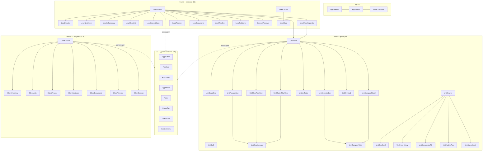

## 9.2 `ui/` — дизайн-система (25 компонентов)

| Компонент | Назначение | Используется |
|---|---|---|
| `AppButton` | 5 вариантов (`primary/default/ghost/danger/dark`), 3 размера, иконка, `loading`, `block` | везде |
| `AppCard` | панель с заголовком, подзаголовком, слотом `#actions`, режимами `padded/flush` | все страницы |
| `AppDrawer` | правая панель (ширина параметром), шапка + прокручиваемое тело + футер | `LeadDrawer`, `ClientDrawer`, `UnitDrawer`, `AutomationBuilder`, панели правки |
| `AppModal` | модалка 4 ширин | формы создания, сравнение, разметка комнат |
| `AppInput`, `AppSelect`, `AppSwitch` | поля формы с подписями, подсказками, ошибкой | все формы |
| `Tabs`, `SegmentedControl`, `Chip` | навигация внутри экрана, переключатели, фильтры | повсеместно |
| `StatusTag` | статусный бейдж (6 тонов, точка, иконка, 2 размера) | 50 файлов |
| `ProgressBar`, `CountdownBadge` | прогресс и обратный отсчёт брони | карточки, дровер |
| `DataTable` | **отдельного компонента нет**: таблицы строятся на CSS-классе `.data-table` + утилитах `useColumnResize`/`useRowNavigation` |
| `DataRoom` | файловое хранилище по категориям с превью, загрузкой, подписью | `LeadDocuments`, `ClientDocuments`, `UnitDocumentsTab` |
| `ContextMenu` | контекстное меню строки (клавиатура, авто-позиция) | клиенты, договоры, список помещений |
| `FilePreview`, `EmptyState`, `PageHeader`, `SectionHeader`, `StepsHeader`, `Breadcrumbs`, `AppAvatar`, `AppSkeleton`, `PageSkeleton`, `ToastHost` | инфраструктура экранов | везде |

## 9.3 `units/` — фонд (38 компонентов)

Три подгруппы (физически лежат в одной папке — см. долг M-17):

1. **Подбор:** `UnitPicker`, `UnitBoardGrid`, `UnitCell`, `UnitFacadeView`,
   `UnitFloorPlanView`, `UnitMasterPlanView`, `UnitListTable`, `UnitZoneCanvas`,
   `UnitFilterBar`, `UnitFilters`, `UnitSelectionBar`, `UnitMiniCard`,
   `UnitTooltip`, `UnitCompareModal`, `UnitCompareTable`.
2. **Карточка помещения:** `UnitDrawer` (5 вкладок), `UnitDealCard`,
   `UnitPriceHistory`, `UnitDocumentsTab`, `UnitActivityTab`, `UnitQueueCard`.
3. **Наполнение фонда:** `ProjectHeader`, `ProjectEditPanel`, `BuildingHeader`,
   `BuildingEditPanel`, `BuildingFillCard`, `BuildingMiniCard`,
   `BuildingSectionCards`, `ManualBoardEditor`, `ImportUnitsWizard`,
   `UnitTypePresetsEditor`, `PresetUnitPicker`, `FloorPlansEditor`,
   `FacadesEditor`, `ImageZoneEditor`, `RoomPlanEditor`, `ExplicationEditor`,
   `MediaGallery`.

**Переиспользование:** `UnitPicker` встроен в 3 страницы и 1 дровер;
`UnitZoneCanvas` — общий рендерер областей для генплана, фасада и плана этажа;
`ImageZoneEditor` — общий редактор разметки (фасад, план этажа, комнаты).

## 9.4 `leads/` — воронка (21)

`LeadDrawer` — контейнер с 5 вкладками (Обзор, Подбор, Финансы, Документы,
История), собирающий 11 дочерних компонентов. Доска: `LeadColumn` + `LeadCard`
+ drag-n-drop через `useLeadDnd`. Вспомогательные: `TaskComposer`,
`ReserveComposer`, `LeadUnitRow`, `LeadAiActions`, `LeadAiSummary`,
`LeadChecklist`, `LeadProfileCard`, `LeadTable`.

«AI» здесь — **эвристики на правилах** (`utils/leadSummary.ts`,
`utils/leadActions.ts`), не модель: считается шанс сделки (`high/medium/low`),
формируется текстовое резюме и список рекомендованных действий.

## 9.5 `clients/` (10), `dashboard/` (4), `charts/` (5), `agenda/` (2), `calendar/` (2), `settings/` (3)

| Компонент | Назначение |
|---|---|
| `ClientsTable` | реестр: 13 колонок, закреплённые колонки, ресайз, клавиатура, контекстное меню |
| `ClientDrawer` | досье: 6 вкладок + быстрые действия + печать |
| `ClientFilterBar` | 13 условий фильтра с счётчиком активных |
| `MetricStrip` | полоса метрик с hero-ячейкой, спарклайном/индикатором |
| `DayKpis` | компактная строка KPI дня (6 ячеек) |
| `BarList` | ранжированный список (продажи по ЖК/менеджерам/источникам) |
| `CompanyAnalytics` | весь аналитический блок дашборда (10 карточек) |
| `ColumnChart`, `PlanFactChart`, `FunnelBars`, `ShareBar`, `Sparkline` | графики на inline-SVG, без библиотек |
| `AgendaRow`, `AgendaList` | строка и список повестки (дашборд) |
| `CalendarDay`, `CalendarWeek` | день по часам и неделя по колонкам |
| `AutomationCard`, `AutomationBuilder`, `SettingsShell` | конструктор правил и оболочка настроек |

## 9.6 Соглашения компонентов

* `<script setup lang="ts">` + типизированные `defineProps`/`defineEmits`.
* Двусторонняя привязка — через `modelValue` + `update:modelValue`.
* Комментарий в шапке компонента объясняет **почему** он такой (продуктовое
  решение), а не что он делает.
* Компонент не ходит в репозитории и не знает о маршрутах, кроме явных
  `navigateTo` в карточках-витринах.
* Иконки — только `ph:*` (Phosphor), размер числом.

---

# 10. Design System

## 10.1 Философия

1. **Токены, а не значения.** Все цвета — CSS-переменные в `:root`; Tailwind
   получает их через функцию `v()`, которая умеет работать с модификаторами
   прозрачности (`bg-ink/40` → `color-mix`). Один источник цвета для CSS,
   inline-стилей и SVG-атрибутов.
2. **Плотность выше воздуха.** Базовый кегль 14.5 px, таблицы 13.5 px,
   подписи 11–12 px. Экран менеджера — рабочий инструмент, а не лендинг.
3. **Цвет = смысл.** Статус помещения, состояние задачи, тон бейджа — из
   справочников `utils/meta.ts`, а не из произвольных классов.
4. **Числа моноширинные.** Класс `.tabular` (`font-variant-numeric: tabular-nums`)
   на всех суммах и датах в таблицах: столбцы должны совпадать по разрядам.
5. **Тёмная тема — не инверсия.** Отдельный набор значений, причём заливки
   ячеек шахматки (`--board-*`) и сплошных кнопок (`--fill-*`) **намеренно не
   зависят от темы**, чтобы белый текст поверх оставался читаемым.
6. **Тени экономно.** Три уровня: `card` (панель), `rise` (наведение),
   `pop` (оверлей).

## 10.2 Токены цвета

| Группа | Переменные | Назначение |
|---|---|---|
| Поверхности | `--bg`, `--panel`, `--soft`, `--line` | фон приложения, карточки, вторичный фон, линии |
| Текст | `--ink`, `--muted` | основной и вторичный |
| Бренд | `--plum`, `--plum-d`, `--plum-bg`, `--rose` | акцент (унаследован от прототипа AVENUE 88) |
| Статусы | `--ok/-bg`, `--warn/-bg`, `--bad/-bg`, `--info/-bg` | семантика |
| Фонд | `--free`, `--reserve/-bg`, `--inst/-bg`, `--sold/-bg` | статусы помещений |
| Шахматка | `--board-reserve/-ink`, `--board-inst/-ink`, `--board-sold/-ink`, `--board-ok/warn/bad` | заливка ячеек + цвет текста поверх |
| Сплошные заливки | `--fill-plum/-d`, `--fill-ok/-d`, `--fill-bad/-d` | кнопки и бейджи с белым текстом |
| Графики | `--c-sold`, `--c-inst`, `--c-reserve`, `--c-free`, `--c-closed`, `--c-step-1..5`, `--c-grid`, `--c-accent` | палитра проверена на различимость при CVD (ΔE ≥ 8) и контраст ≥ 3:1 |
| Модули | `--mod-objects/price/sales/reserve/finance/docs/analytics/users/system` | цвет иконки раздела в меню |
| Сайдбар | `--side`, `--side-panel`, `--side-ink`, `--side-line` | тёмная панель в обеих темах |

Переключение темы: `plugins/theme.client.ts` выставляет `data-theme` до первого
рендера; `AppTopbar` переключает `light/dark/system` и пишет в `localStorage`.

## 10.3 Типографика

| | |
|---|---|
| UI-шрифт | `Onest` (400–800), переменная `--f-ui` |
| Акцентный | `Unbounded` (400–700), `--f-disp`, класс `.font-disp` — логотип и крупные заголовки |
| Заголовок страницы | 22 px / 600 / `tracking-[-0.025em]` |
| Витринный заголовок | 24 px / 600 (`ProjectHeader`, `BuildingHeader`) |
| Крупная метрика | 48 px (hero в `MetricStrip`), 25 px (обычная), 19–20 px (KPI дня) |
| Текст | 14.5 px база, 13 px в карточках, 12.5 px подписи |
| Таблицы | 13.5 px тело, 11.5 px заголовок (uppercase, `letter-spacing: .02em`) |

## 10.4 Радиусы, отступы, тени

| Токен | Значение | Где |
|---|---|---|
| `--r` → `rounded-xl2` | 7 px | кнопки, поля, чипы, мелкие блоки |
| `--r-card` → `rounded-card` | 10 px | карточки, панели, дровер |
| `rounded-full` | — | бейджи, точки статуса |
| Сетки | `gap-4` (16 px) между карточками, `gap-px` + фон `bg-line` для «волосяных» разделителей внутри полос KPI |
| Отступы страницы | `px-4 py-5` (моб.) / `lg:px-7 lg:py-6` |
| `--shadow-card` / `rise` / `pop` | см. `main.css` | панель / ховер / оверлей |

## 10.5 Компоненты дизайн-системы

### Кнопка (`AppButton`)
5 вариантов × 2 размера (`sm` 32 px, `md` 40 px), опции: `icon`, `iconRight`,
`loading` (спиннер `ph:spinner-gap`), `block`, `disabled`.
Фокус — общий класс `.focus-ring` (двойное кольцо: цвет панели + бренд).

### Бейдж (`StatusTag`)
6 тонов (`ok/warn/bad/info/neutral/plum`), опции `dot`, `icon`, размеры `sm/md`.
Тон приходит из справочника (`UNIT_STATUS_META[status].tone`), а не задаётся
вручную.

### Drawer (`AppDrawer`)
Правая панель поверх затемнения `bg-ink/35`, ширина — параметр
(`min(580px,100vw)` карточка помещения, `min(1200px,100vw)` досье клиента,
`min(680px,96vw)` конструктор правил). Структура: шапка (заголовок + подзаголовок
+ крестик) → прокручиваемое тело → опциональный футер.
**Фокус не запирается (focus trap отсутствует)** — долг M-22.

### Tabs / SegmentedControl
`Tabs` — вкладки с иконкой и счётчиком (подчёркивание активной);
`SegmentedControl` — компактный переключатель режимов (подсветка активного
сегмента). Правило: `Tabs` переключают **содержимое**, `SegmentedControl` —
**представление того же содержимого**.

### Таблица (`.data-table` + утилиты)
Отдельного компонента-таблицы нет. Есть CSS-класс и три поведения:
* `.data-table` — базовая стилистика (липкая шапка, `tabular`, зебра по ховеру);
* `.table-scroll` — контейнер с `max-height: calc(100vh - 232px)`, ради которого
  работает `position: sticky` шапки;
* `useColumnResize` (`.col-grip`) и `useRowNavigation` (`.is-cursor`).
Закреплённые колонки реализованы точечно в `ClientsTable` (`.pin`, `.pin--name`).

### ProgressBar / CountdownBadge / EmptyState / Toast
`ProgressBar` — 3 тона, опциональная подпись; `CountdownBadge` — обратный отсчёт
брони с тоном по остатку; `EmptyState` — иконка + заголовок + текст + слот
действия (встречается в 41 файле); `ToastHost` — очередь уведомлений (3.6 с).

### Data Room (`DataRoom`)
Хранилище файлов по 8 категориям (`DOC_KIND_META`): drag-and-drop, превью
(`FilePreview`), отметка «подписан», смена категории, подсказка о недостающих
документах (`required`).

## 10.6 Иконки и графика

* Только `ph:*` (Phosphor) через `@nuxt/icon`, собраны в бандл.
* Все графики — inline-SVG собственных компонентов (`charts/`), без внешних
  библиотек: колонки, план/факт, воронка, доли, спарклайн.
* Демо-изображения (фасады, планы, планировки, генплан) — SVG data-URI из
  `data/placeholders.ts`; геометрия экспортируется, чтобы разметка областей
  ложилась ровно на нарисованные объекты.

---

# 11. Автоматизации

## 11.1 Модель правила (`types/automation.ts`)

```ts
AutomationRule = {
  id, name, enabled, builtin?,
  trigger: AutomationTriggerKind,   // 8 событий
  offsetHours?: number,             // окно ожидания для временных триггеров
  conditions: AutomationCondition[] // поле + оператор + значение (всегда «И»)
  actions: AutomationAction[]       // что сделать
  runs, lastRunAt?, createdBy?, createdAt?
}
```

### Триггеры

| Kind | Группа | Тип | Окно | Условия | Действия |
|---|---|---|---|---|---|
| `lead.created` | Продажи | событие | — | ЖК, приоритет, источник, бюджет | задача, уведомить, метка |
| `lead.stalled` | Продажи | **по времени** | дней без движения (5) | этап, приоритет, источник, бюджет | уведомить, задача, метка |
| `visit.completed` | Продажи | событие | — | ЖК, приоритет, этап | задача, уведомить, этап |
| `reservation.created` | Бронь | событие | — | ЖК, вид брони, задаток, цена, тип помещения | уведомить, задача |
| `reservation.expiring` | Бронь | **по времени** | за N часов (24) | ЖК, вид брони, задаток, цена | уведомить, задача |
| `reservation.expired` | Бронь | **по времени** | — | ЖК, вид брони, цена | предложить очереди, вернуть в продажу, уведомить, задача |
| `contract.signed` | Финансы | событие | — | ЖК, сумма, тип помещения | уведомить, задача, метка |
| `payment.overdue` | Финансы | **по времени** | начиная с N дней (1) | ЖК, дней просрочки, сумма | уведомить, задача |

### Условия
13 полей (`ConditionField`): `project`, `priority`, `source`, `stage`, `budget`,
`unitStatus`, `unitKind`, `rooms`, `price`, `reservationKind`, `deposit`,
`overdueDays`, `amount`. Операторы: `eq`, `neq`, `gt`, `lt`. Все условия
объединяются **логическим «И»** — «или» собирается вторым правилом.

### Действия
| Kind | Параметры | Что делает в коде |
|---|---|---|
| `notify` | кому (менеджер/руководитель/директор/сотрудник), текст | `misc.notify()` с ключом `auto-<actionId>-<ctx.key>` |
| `task` | текст, вид задачи, отложить на N часов, исполнитель | `sales.addLeadTask()` (пропускает заявки в `deal`/`lost`) |
| `stage` | этап | `sales.moveLead()` |
| `tag` | метка | `sales.toggleLeadTag()` |
| `freeUnit` | — | `units.setStatus(free)` (только если брони действительно нет) |
| `offerQueue` | — | `sales.offerUnitToQueue()` |

Подстановки в текстах: `{клиент}`, `{объект}`, `{дом}`, `{проект}`, `{срок}`,
`{сумма}`, `{менеджер}`, `{договор}` (`fillTemplate`).

## 11.2 Встроенные правила (`data/automations.ts`)

| id | Название | Триггер | Действия |
|---|---|---|---|
| `rule-lead-first-call` | Первый звонок по новой заявке | `lead.created` | задача «Первый звонок клиенту» через 24 ч |
| `rule-visit-followup` | Follow-up после показа | `visit.completed` | задача «Узнать впечатления» через 24 ч |
| `rule-reservation-warning` | Предупредить, что бронь на исходе | `reservation.expiring` (24 ч) | уведомление + задача-звонок через 2 ч |
| `rule-reservation-expired` | Снятие истёкшей брони | `reservation.expired` | предложить очереди → вернуть в продажу → уведомить |
| `rule-payment-overdue` | Оповещение о просрочке | `payment.overdue` (1 день) | уведомление руководителю |
| `rule-contract-signed` | Договор подписан — предупредить финансы | `contract.signed` | уведомление руководителю |
| `rule-lead-stalled` | Заявка застряла на этапе | `lead.stalled` (120 ч = 5 дней) | уведомление менеджеру |

Встроенные правила настраиваются и отключаются, но **не удаляются**
(`removeRule` возвращает `false` для `builtin`).

## 11.3 Flow выполнения

```mermaid
flowchart TD
  A1["Событие в сторе<br/>sales / deals"] -->|fire(trigger, ctx)| F
  A2["Вход в приложение<br/>layouts/default"] -->|runAutomations()| T["runTimed(now)"]
  T --> T1["брони: hoursLeft <= offsetHours"]
  T --> T2["истёкшие брони: expiresAt <= now<br/>(статус закрывается всегда)"]
  T --> T3["договоры: overdueDays >= offset"]
  T --> T4["заявки: daysInStage >= offset"]
  T1 & T2 & T3 & T4 --> F
  F["fireRule(rule, ctx)"] --> C{"matchesConditions?"}
  C -->|нет| STOP1["пропуск"]
  C -->|да| G{"fired содержит<br/>rule.id:ctx.key?"}
  G -->|да| STOP2["пропуск (дедупликация)"]
  G -->|нет| RUN["runAction() по каждому действию"]
  RUN --> E{"есть эффекты?"}
  E -->|нет| STOP3["в журнал не пишем"]
  E -->|да| LOG["runs.unshift(...)<br/>rule.runs++<br/>lastRunAt"]
```

**Ограничение шума:** `MAX_PER_RUN = 5` — одно временное правило срабатывает не
более 5 раз за прогон; остаток по застрявшим заявкам уходит одной сводкой
(«Без движения ещё N заявок»).

**Гигиена данных вне правил** (выполняется всегда, независимо от включённости):
бронь с прошедшим сроком закрывается; помещение «в брони» без активной брони
возвращается в продажу; график платежей создаётся при подписании договора.

## 11.4 Конструктор в UI (`/settings/automations`)

* Полоса состояния: правил, включено, срабатываний, последнее.
* **Готовые сценарии** — 4 шаблона в один клик (бронь за сутки; follow-up через
  сутки; дорогая бронь без задатка → руководителю; просрочка > недели → директору).
* Список правил карточками-конвейерами: `Когда → Если → То`, счётчик
  срабатываний, переключатель, «Настроить», «Дублировать», «Удалить».
* `AutomationBuilder` (дровер): 3 шага (событие → условия → действия) +
  предпросмотр фразой (`describeRule`) + валидация (пустое значение условия,
  пустой текст действия).
* Журнал: когда, какое правило, по какому объекту, что сделано (последние 20 из 60).
* Ниже — блок «Что система делает всегда», настройки очереди брони и лимиты
  скидок.

## 11.5 Чего в движке нет

| | |
|---|---|
| Персистентность правил | **не реализовано** — правила живут в памяти, F5 возвращает 7 встроенных |
| Планировщик на сервере | **не реализовано** — временные правила считаются при входе |
| Ветвления, «или», вложенные условия | **не реализовано** (только «И») |
| Отложенные действия как очередь | частично: `delayHours` влияет на срок задачи, но само действие выполняется сразу |
| Действия «письмо/SMS/WhatsApp/вебхук» | **не реализовано** |
| Симулятор правила («что было бы») | **не реализовано** |

---

# 12. Шахматка / Генплан / Фасад

Самая нагруженная часть системы: 15 компонентов, один стор состояния, три
утилитарных модуля. Идея одна: **пять представлений одного набора помещений**,
а не пять разных экранов.

## 12.1 Схема подбора

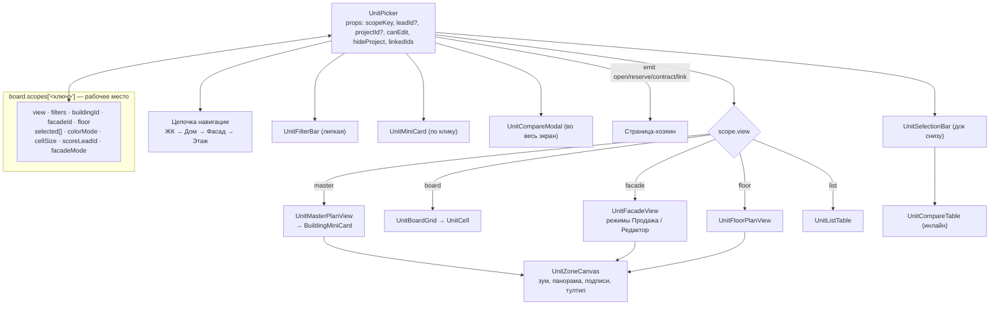

## 12.2 Скоупы: как синхронизируются фильтры и выделение

`board.scopes` — словарь «рабочих мест». Один и тот же `UnitPicker`,
подключённый с разными `scopeKey`, ведёт себя как разные инструменты:

| Ключ | Где используется | Что это значит |
|---|---|---|
| `board` | `/board` | фильтр и выделение менеджера на шахматке, сохраняются между сессиями |
| `lead:<id>` | `LeadDrawer` → вкладка «Подбор», мастер сделок с `?lead=` | подбор под конкретного клиента; включён скоринг (`scoreLeadId`) |
| `deal` | `/deals/new` без заявки | выбор объекта в мастере |
| `contract:<id>` | допродажа к договору | (скоуп предусмотрен в `usePickerPersistence`) |

Внутри одного скоупа фильтр и выделение **общие для всех пяти представлений**:
выделил три квартиры на фасаде → они выделены в шахматке, в списке и в доке
сравнения. Реализовано тем, что представления не держат собственного состояния
— они читают `board.scope(scopeKey)`.

Сохранение (`usePickerPersistence`): `view`, `filters`, `buildingId`,
`colorMode`, `cellSize`, `facadeMode` пишутся в
`localStorage: kvartal:picker:<userId>`; скоупы `lead:*` и `contract:*` **не
сохраняются** — вчерашний подбор чужого клиента не должен всплывать.

## 12.3 Фильтр (`utils/unitFilters.ts`)

`UnitFilterState`: `search`, `statuses[]`, `kinds[]`, `rooms[]`, `sections[]`,
`floorMin/Max`, `areaMin/Max`, `priceMin/Max`, `finishing[]`, `onlyDiscount`,
`onlyFree`.
Функции: `matchesUnitFilters`, `activeFilterCount`, `hasAnyFilter`,
`describeFilters` (чипы активных условий), `clearFilterGroup`,
**`filtersFromInterest(interest)`** — превращает запрос клиента в фильтр
(кнопка «Фильтр из запроса» в карточке заявки).

Не прошедшие фильтр помещения не исчезают, а гаснут (`dim`) — фасад и шахматка
должны читаться целиком.

## 12.4 Представления

### Генплан (`UnitMasterPlanView`)
* Картинка — `project.masterPlans[0]`, контуры домов — `masterPlanZones`
  (`refId = building:<id>`).
* Цвет дома — по доле свободных (`colorOf`): всё продано → `--c-sold`,
  < 20 % → `--c-inst`, < 50 % → `--c-reserve`, иначе `--c-free`.
* Клик по дому открывает `BuildingMiniCard`: свободно (% и штуки), продано,
  в брони, количество квартир, средняя цена, цена за м², цена «от» и три
  действия — «На фасад», «Шахматка», «Дом».
* Справа — список домов теми же цифрами (общий геттер `units.buildingStats`).

### Шахматка (`UnitBoardGrid` + `UnitCell`)
* Секции → этажи → ячейки; ось этажей слева, шапка секции с «продано N из M».
* Два режима окраски: `status` (статус помещения) и `payment` (состояние оплат
  по договору — `utils/board.ts: healthFromBucket`).
* Два размера ячейки (`compact` / `large`).
* Ячейка рисуется явной сеткой (номер, комнатность, метка акции, полоса
  оплаты, значок очереди, процент совпадения) — бейджи не накладываются друг
  на друга.
* Клик → мини-карточка, Ctrl/Cmd/Shift+клик → выделение.

### Фасад (`UnitFacadeView`)
* Ракурсы (`FacadeView[]`) переключаются чипами; показываются только с картинкой.
* **Два режима** (`board.facadeMode`, доступен при `canEdit`):
  * **Продажа** — только статусы, цены, проценты совпадения, диапазон цен
    свободных квартир; авторазметка не подсвечивается;
  * **Редактор** — пунктир на выведенных контурах, счётчик «размечено вручную
    N из M», статус публикации, ссылка на разметку (`/facades/...`).
* Контуры считает `utils/facade.ts: facadeUnitZones()`:
  1. если есть ручная разметка `unit:<id>` — берётся она;
  2. иначе помещения этажа раскладываются по полосе этажа
     (`floor:<n>` или геометрия плейсхолдера) слева направо, с зазорами;
  3. такие контуры помечаются `derived` — интерфейс честно это показывает.

### План этажа (`UnitFloorPlanView`)
Картинка `FloorPlan.imageUrl` + зоны `refId = <unitId>`; переключатель этажей,
те же тултипы и выделение.

### Список (`UnitListTable`)
Сортируемая таблица (номер, тип, комнаты, площадь, этаж, цена, цена/м², статус,
совпадение) с липкой шапкой, изменяемыми ширинами, клавиатурой и контекстным
меню (открыть / бронь / договор / в сравнение / копировать номер).

## 12.5 Выделение, сравнение, действия

* **Выделение** — `scope.selected[]`, порядок сохраняется (по нему строится
  сравнение). Ctrl+клик в любом представлении, «Выделить всё» в списке.
* **Док снизу** (`UnitSelectionBar`): плитки выбранных, сумма/площадь/цена м²,
  кнопки «Сравнить (C)», «Бронь (B)», «Договор (D)», массовая смена статуса
  (право `unit.editStatus` — у продавцов его нет), массовая смена цены
  (право `unit.editPrice`),
  экспорт в Excel, «Снять выделение».
* **Сравнение** — инлайн-панель в доке (до 4 позиций, `MAX_COMPARE`), лучшие
  значения подсвечиваются; «Во весь экран» открывает `UnitCompareModal`.
  Таблица одна (`UnitCompareTable`) в обоих режимах.
* **Мини-карточка** (`UnitMiniCard`) — по клику: параметры, цена и цена м²,
  акция, состояние сделки (клиент, договор, оплачено, остаток, ближайший
  платёж), бронь с обратным отсчётом, очередь, разбор совпадения и действия
  (в подборку / бронь / договор / сравнение / карточка).
* **Горячие клавиши** (`useHotkeys`): `B` бронь, `D` договор, `C` сравнение,
  `Esc` сброс; работают в обеих раскладках, игнорируются в полях ввода.

## 12.6 Скоринг под клиента

`useLeadMatching.scoreUnit(unit, interest)` — 100 баллов минус штрафы:
комнатность (18 × отклонение, максимум 2 шага), площадь (12), этаж, бюджет,
статус. Результат: `score`, список `misses` («2 комн.», «63 м²») и `factors`
с разбором. Скоринг считается **только** для `free`/`reserved` квартир и
коммерции — показывать процент на проданном бессмысленно.

Где виден: бейдж на ячейке шахматки, на контуре фасада, колонка в списке,
мини-карточка, сравнение, вкладка «Подбор» карточки заявки.

## 12.7 Очередь на объект

`UnitQueueCard` (в карточке помещения): добавить интересанта, посмотреть
очередь, снять. При истечении брони правило `reservation.expired` вызывает
`offerUnitToQueue()` — первый в очереди получает бронь без задатка на сутки,
помещение остаётся `reserved`, менеджеру приходит уведомление. Если очереди
нет — помещение возвращается в продажу.

---

# 13. Клиенты

## 13.1 Почему модуль устроен именно так

`Lead` — это **процесс** (заявка в воронке), `Client` — **человек с договором**.
Досье клиента нигде не хранится целиком: его собирает чистая функция
`buildClientProfile(client, sources)` из семи источников. Любая сумма в реестре
клиентов — производная от договоров и графиков, поэтому она физически не может
разойтись с карточкой договора.

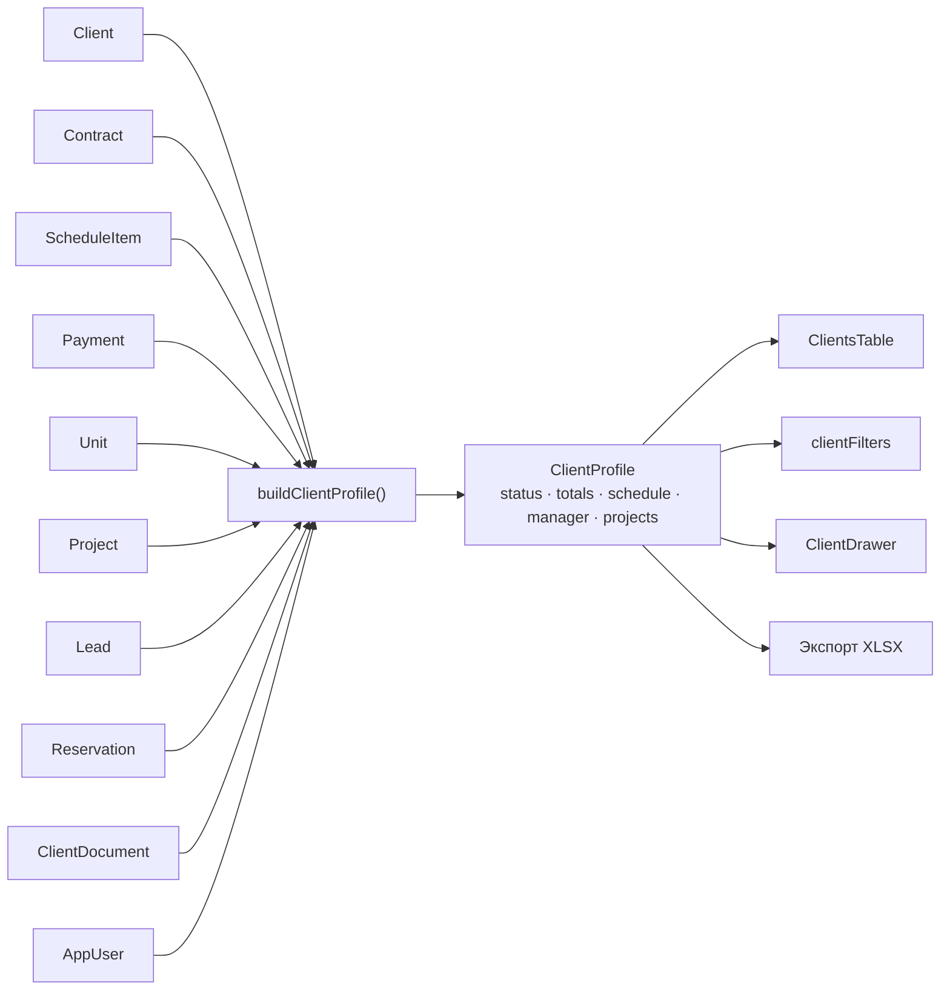

## 13.2 Что вычисляется (`ClientProfile.totals`)

| Поле | Как считается |
|---|---|
| `status` | `paid` (всё оплачено) / `installment` / `active` / `prospect` — из договоров |
| `purchases` | сумма договоров |
| `paid`, `remaining`, `paidPct` | из `ScheduleItem.paid` против `amount` |
| `overdueAmount`, `overdueDays`, `overdueCount` | просроченные строки графика |
| `unitsCount`, `area` | помещения всех договоров |
| `discount` | сумма скидок по договорам |
| `avgCheck` | LTV / количество договоров |
| `nextDue` | ближайшая неоплаченная строка графика |
| `manager`, `project`, `projects` | из договоров и заявок |
| `lastActivityAt/Label` | последняя активность из заявок, платежей, документов |

## 13.3 Реестр (`/clients`)

* **13 колонок** (`utils/clientColumns.ts`): клиент, телефон, ЖК, объекты,
  менеджер, договор, статус, сумма, оплачено, остаток, следующий платёж,
  просрочка, дата покупки, последняя активность.
* **Фильтры** (`ClientFilterState`, 17 полей): поиск, ЖК, дом, менеджер,
  статус договора, способ оплаты, банк, тип помещения, валюта, период
  следующего платежа, дата покупки (от/до), сумма договора (от/до),
  «есть просрочка», «только VIP», «только покупатели».
* **Поведение таблицы:** сортировка по любой колонке, показ/скрытие колонок
  (сохраняется), ширины колонок (сохраняются), закреплённые первые колонки,
  липкая шапка, клавиатура, контекстное меню, массовое выделение с итогами,
  экспорт в XLSX.

## 13.4 Досье (`ClientDrawer`, ширина `min(1200px, 100vw)`)

| Вкладка | Содержимое |
|---|---|
| **Обзор** | досье (13 полей), аналитика клиента (LTV, средний чек, объекты, скидка, просрочки, последний контакт), AI-резюме текстом, «Деньги» (объём, оплачено %, остаток, просрочка/ближайший платёж), «Где купил» |
| **Объекты** | купленные помещения с переходом в карточку |
| **Финансы** | состояние счёта (5 показателей) + график «План / Факт / Остаток / Статус» с фильтром по состоянию строки + «Добавить оплату» |
| **Договоры** | список договоров с суммой, статусом, помещениями |
| **Документы** | `DataRoom` по 8 категориям |
| **История** | единая лента (`buildClientTimeline`): собирает ленты всех заявок клиента + брони и договоры без заявки + платежи + документы |

**Быстрые действия:** позвонить, WhatsApp, создать документ, добавить оплату,
открыть помещение, печать досье (`ClientDossier` → `#print-portal` → печать
браузера в PDF).

## 13.5 Где данные всё-таки дублируются

Честно: полностью бездублевой модель не является.

| Место | Что продублировано | Почему так сделано |
|---|---|---|
| `Unit.contractId`, `Unit.reservationId` | обратные ссылки | шахматка не может искать договор по массиву `unitIds` на каждой ячейке |
| `Project.buildingIds` | список домов | быстрый доступ без фильтра по всем домам |
| `Unit.projectId` | при наличии `buildingId` | фильтры фонда по проекту без джойна |
| `Lead.nextAction`, `Lead.nextAt` | дублируют ближайшую задачу | помечены в коде как устаревшие поля для виджетов |
| `Lead.budget` и `interest.budgetMax` | две суммы | `budget` — рабочая сумма воронки, синхронизируется при правке вилки |

---

# 14. Плюсы архитектуры

## 14.1 Единый подбор помещений
`UnitPicker` — один компонент на шахматку, карточку заявки, мастер сделок и
допродажу. Пять представлений читают одно состояние (`board.scopes`), поэтому
фильтр и выделение не расходятся, а менеджеру не нужно переучиваться при
переходе между разделами. Это главное архитектурное решение продукта.

## 14.2 Разделение `Lead` и `Client`
Заявка — процесс, клиент — человек с договором. Благодаря этому один клиент
может иметь несколько заявок и несколько сделок, а конверсия считается по
заявкам, а не по контактам.

## 14.3 Вычисляемое досье вместо агрегата
`buildClientProfile` — чистая функция без побочных эффектов; отдельной таблицы
«клиент-итоги» нет. Отсюда: нет рассинхрона сумм, нет миграций при изменении
правил расчёта, логика тестируема (когда появятся тесты).

## 14.4 Репозитории как контракт будущего API
`await repo.fetchX()` в сторах с первого дня. Когда появится сервер, меняются
только тела девяти модулей в `repositories/` — сигнатуры, сторы и компоненты
остаются. Это редкая для прототипа предусмотрительность.

## 14.5 Автоматизации как данные
Правило — это объект (`AutomationRule`), а не код. Встроенные сценарии описаны
теми же правилами, что и пользовательские, поэтому экран настроек показывает
ровно то, что система делает. Добавление нового действия — одна ветка в
`runAction` плюс запись в `ACTION_META`.

## 14.6 Право как возможность
`Capability` закрывает меню, маршрут и кнопку одновременно; добавление роли —
строка в `ROLE_CAPS`. Нет «прав по названию страницы», нет дублирования
проверок в разметке.

## 14.7 Дизайн-система на токенах
Цвета живут в CSS-переменных и доступны и Tailwind, и inline-стилям, и SVG.
Тёмная тема — отдельный набор значений с осознанными исключениями (заливки
ячеек и сплошных кнопок не меняются). Палитра графиков проверена на
различимость при нарушениях цветовосприятия.

## 14.8 Честные состояния наполнения
`sectionFill()` считает процент заполнения дома по фактическим данным
(номера/площади/цены, привязка планировок, размеченные планы и фасады), а не по
галочкам. Пустой раздел не может показать 100 %.

## 14.9 Детерминированные демо-данные
`makeRng(88420)` — один сид, воспроизводимая витрина: скриншоты, демонстрации и
отладка не «плывут» между запусками. При этом `TODAY` привязан к текущей дате,
поэтому демо не протухает.

## 14.10 Однородность экранов
Пять паттернов повторяются во всём приложении: витринная шапка (проект, дом),
полоса KPI, карточка с `#actions`, дровер с вкладками, реестр с липкой шапкой и
контекстным меню. Новый раздел собирается из готовых кусков за часы.

## 14.11 Комментарии «почему», а не «что»
В коде систематически объясняются продуктовые решения (почему бронь не может
висеть без объекта, почему пунктир на фасаде, почему скоринг не показывают на
проданном). Для передачи проекта это дороже любого README.

---

# 15. Минусы и технический долг

Приоритеты: **Critical** — без этого нельзя в прод; **High** — сломается на
первых реальных данных или пользователях; **Medium** — замедляет разработку;
**Low** — гигиена.

## 15.1 Сводная таблица

| ID | Приоритет | Проблема | Где |
|---|---|---|---|
| C-1 | Critical | Нет сервера и персистентности: все изменения теряются при F5 | `repositories/*`, `data/seed.ts` |
| C-2 | Critical | Вход принимает любой код, неизвестный телефон входит **директором** | `repositories/auth.ts:12–15` |
| C-3 | Critical | Права только на клиенте; все данные всех ролей лежат в браузере | `middleware/access.global.ts`, `utils/access.ts` |
| C-4 | Critical | Деньги в `number` с `Math.round` | `deals.ts`, `clientProfile.ts`, `finance.ts` |
| C-5 | Critical | Мультивалютность заявлена, но агрегаты складывают суммы без конвертации | `format.ts:5`, `deals.registerPayment` |
| H-6 | High | Правила автоматизаций не сохраняются | `stores/automations.ts` |
| H-7 | High | Идемпотентность правил держится на массиве в памяти | `automations.fired` |
| H-8 | High | `fired` и `board.scopes` растут без очистки | `automations.ts`, `board.ts` |
| H-9 | High | Логика «своё/всё» размазана по 5 местам, `useAccess().mine()` не используется | 5 файлов |
| H-10 | High | Отчёты читают пользователей из `data/catalog`, минуя стор | `pages/reports/index.vue` |
| H-11 | High | Мёртвая защита клавиатуры в реестре клиентов | `ClientsTable.vue:66` |
| H-11b | High | `layouts/default.vue` использовал `mode="out-in"`: в фоновой вкладке `requestAnimationFrame` заморожен, уход скелетона не завершался и страница залипала — **исправлено в `7019b94`** | `layouts/default.vue` |
| M-19b | Medium | Повестка дня сравнивала статус договора с несуществующим `'cancelled'` вместо `'terminated'`, из-за чего платежи по расторгнутым договорам попадали в план дня — **исправлено в `ebe71bd`** | `utils/agenda.ts:123` |
| H-12 | High | Нет тестов и CI | весь репозиторий |
| H-13 | High | Пересборка всех профилей клиентов на любое изменение | `useClientProfiles.ts` |
| H-14 | High | Нет виртуализации и пагинации | шахматка, реестры |
| H-15 | High | Записи без отката и конфликтов (fire-and-forget) | все сторы |
| H-16 | High | Ошибки загрузки не обрабатываются — вечный скелет | `layouts/default.vue` |
| M-17 | Medium | Крупные файлы и «свалка» в `components/units` | `ImageZoneEditor` 600, `UnitDrawer` 491, `seed.ts` 984 |
| M-18 | Medium | Мёртвый код | `expireReservations`, `loginAsDemo`, `commandOpen`, `ApiError`, пустые папки компонентов |
| M-19 | Medium | Переплата при подтверждении платежа теряется | `deals.confirmPayment` |
| M-20 | Medium | Конвертируется только первая бронь мультиобъектной сделки | `deals.createContract` |
| M-21 | Medium | Два источника времени: `TODAY` и `new Date()` | `sales`, `deals` vs `agenda`, `UnitDrawer` |
| M-22 | Medium | Доступность: нет focus trap, `aria-*`, клавиатурной альтернативы drag-n-drop | `AppDrawer`, `AppModal`, `/leads` |
| M-23 | Medium | Нет i18n, форматы зашиты в `ru-RU` | `format.ts` + точечные `toLocaleDateString` |
| M-24 | Medium | Мобильная версия частичная | шахматка, календарь, реестры |
| M-25 | Medium | Файлы — blob-ссылки, живут до перезагрузки | `useFileUpload`, `ClientDocument.url` |
| M-26 | Medium | Документы «формируются» без файла | `misc.generateDocument` |
| M-27 | Medium | Права ролей не покрывают часть объявленных ролей | `ROLE_CAPS` |
| L-28 | Low | Дублирование цветовых карт статусов | `utils/meta.ts` |
| L-29 | Low | Нет версионирования сохранённых настроек | `usePickerPersistence` (`VERSION = 1`) |
| L-30 | Low | `xlsx` грузится всегда | `pages/clients`, `ImportUnitsWizard` |
| L-31 | Low | Страница ошибки без диагностики | `app/error.vue` |
| L-32 | Low | Нет мониторинга и продуктовой аналитики | — |
| L-33 | Low | Шрифты с Google Fonts при офлайн-иконках | `nuxt.config.ts` |

## 15.2 Critical — подробно

### C-1. Система без хранилища
`repositories/*` возвращают `delay(clone(SEED))` на чтение и `delay(value)` на
запись. Всё, что пользователь сделал за сессию — брони, договоры, платежи,
правила автоматизаций, загруженные файлы — исчезает при перезагрузке.
Пять ключей `localStorage` (сессия, тема, фильтры подбора, колонки, ширины)
переживают F5 — данные нет.
**Следствие:** прототип нельзя показывать как «работающую систему» дольше одной
сессии. **Что делать:** реальный API + БД (модель уже спроектирована, см.
раздел 7), сохранение — через те же девять модулей.

### C-2. Фиктивная авторизация с опасным дефолтом
```ts
// repositories/auth.ts
export function verifyCode(phone: string, code: string): Promise<AppUser> {
  const user = USERS.find((u) => u.phone === normalized) ?? USERS[0]!  // ← директор
  return delay(clone(user), 500)
}
```
Код не проверяется вовсе, а неизвестный номер входит под `USERS[0]` —
директором со всеми правами. Для демо это удобно, для любого внешнего показа —
дыра. Плюс `auth.loginAsDemo()` — заглушка, которая ничего не делает.

### C-3. Права существуют только в UI
`middleware/access.global.ts` — клиентская проверка; сами данные (все заявки,
договоры, платежи, паспорта) загружены в память браузера у любой роли.
Менеджер, открыв devtools, видит всё. **Ролевая модель сейчас — это UX, а не
безопасность**, и в документации по ролям это должно быть написано прямо.

### C-4. Денежная арифметика на `number`
Цены, скидки, графики и разнос платежей считаются в плавающей точке с
`Math.round` (`deals.createContract`, `confirmPayment`, `clientProfile`,
`finance.calcForecast`). На демо-данных незаметно; на реальных суммах в сомах
с копейками даст расхождение графика и «остаток 0.01». Нужны минорные единицы
(целые копейки) или decimal-библиотека — и это решение уровня API, а не UI.

### C-5. Мультивалютность наполовину
`Currency`, `Project.currency`, `Contract.currency`, `Payment.currency` в модели
есть. При этом `money(value, currency = 'USD')` по умолчанию рисует доллары,
`registerPayment` жёстко ставит `'USD'`, а агрегаты (выручка компании, итоги
реестра клиентов, KPI дня) складывают суммы договоров **без конвертации**.
Пока оба демо-проекта в USD, это не видно — при первом проекте в KGS цифры
станут бессмысленными.

## 15.3 High — подробно

**H-6/H-7/H-8. Автоматизации живут в памяти.** `rules` инициализируются
`builtinRules()` при создании стора, журнал `runs` и защита `fired` — тоже.
После перезагрузки: пользовательские правила исчезли, временные правила
сработают заново и продублируют задачи. `fired` и `board.scopes` никогда не
чистятся — на длинной сессии это медленная утечка.

**H-9. Четыре реализации одного правила.** «Менеджер видит только своё»
написано в `useClientProfiles`, в `pages/index.vue`, в `contracts/index.vue`,
в `payments/index.vue` и в `leads/index.vue` — каждый раз по-своему
(`assignedTo`, `contract.leadId → lead.assignedTo`, `manager?.id`).
Готовая `useAccess().mine()` не используется **нигде**. Любое изменение
правила придётся вносить в пяти местах — и один из них забудут.

**H-10. Два источника пользователей.** `pages/reports/index.vue`, `pages/users`,
`pages/login` и `stores/auth` берут `USERS` прямо из `data/catalog`, а не из
`settings.users`. Пользователь, созданный через «Пригласить пользователя», в
отчёты не попадёт.

**H-11. Мёртвая защита.** `enabled: () => !document.querySelector('[data-drawer-open]')`
в `ClientsTable` — атрибут `data-drawer-open` не выставляется нигде, значит
стрелки продолжают двигать курсор по таблице, когда открыто досье.

**H-12. Ноль тестов.** Ни `*.spec.ts`, ни `*.test.ts`, ни CI-конфига. При этом
в проекте есть идеальные кандидаты на юнит-тесты: `clientProfile`,
`unitFilters`, `useLeadMatching`, `automation`, `access`, `facade`, `analytics`
— все чистые. Регрессии сейчас ловятся только ручным прогоном.

**H-13. Квадратичная сборка досье.** `useClientProfiles` строит профиль для
**каждого** клиента на любое изменение любого из шести сторов; каждый профиль
фильтрует все договоры, графики, платежи, заявки и документы. 49 клиентов —
незаметно; 5 000 клиентов × 20 000 строк графика — заметно очень.

**H-14. Нет виртуализации и пагинации.** Шахматка рендерит все ячейки дома,
реестры — все строки. 235 помещений и 49 клиентов работают мгновенно; фонд из
10 000 помещений положит вкладку.

**H-15. Записи без отката.** `Object.assign(entity, patch)` + `repo.save*()`
без `await` и без обработки ошибки. Нет оптимистичных обновлений с откатом, нет
версий записи, нет разрешения конфликтов — всё это придётся вводить вместе с
сервером.

**H-16. Вечный скелет.** `layouts/default.vue` делает `await Promise.all([...load()])`
без `try/catch`. Если репозиторий упадёт, `ready` навсегда останется `false` —
пользователь увидит скелет и ничего больше.

## 15.4 Medium — подробно

* **M-17. Крупные файлы.** `ImageZoneEditor.vue` 600, `UnitDrawer.vue` 491,
  `UnitPicker.vue` 391, `CompanyAnalytics.vue` 321, `stores/units.ts` 527,
  `stores/sales.ts` 483, `data/seed.ts` 984. Папка `components/units` — 38
  файлов трёх разных назначений (подбор, карточка, наполнение фонда).
* **M-18. Мёртвый код.** `sales.expireReservations()` больше не вызывается
  (логика переехала в `automations.runTimed`), `auth.loginAsDemo()` — пустышка,
  `ui.commandOpen` не используется, `ApiError` объявлен и не выбрасывается,
  в `nuxt.config` объявлены несуществующие папки `components/pricing` и
  `components/documents` (сборка пишет предупреждения).
* **M-19.** `confirmPayment` разносит сумму по графику FIFO и молча теряет
  остаток при переплате; `PaymentKind` содержит `refund`, `offset`, `barter` —
  обработки этих видов нет.
* **M-20.** `createContract` конвертирует только первую найденную активную бронь
  (`.map(...).find(Boolean)`): при продаже «квартира + паркинг» вторая бронь
  останется активной, а помещение уже будет под договором.
* **M-21. Два времени.** `sales.taskState`, `daysInStage`, `deals.balance`,
  `paymentBoardBucket` считают от `TODAY` (09:00), а повестка дня, брони и
  мини-карточка — от `new Date()`. Внутри дня расхождение безобидно, на сервере
  так нельзя: нужна одна точка «сейчас» и таймзона аккаунта.
* **M-22. Доступность.** Дровер и модалка не запирают фокус и не возвращают его
  при закрытии; у сортируемых колонок нет `aria-sort`; drag-n-drop воронки не
  имеет клавиатурной альтернативы; контрасты проверялись только для графиков.
* **M-23. Локализация.** Строки вшиты в компоненты, `format.ts` жёстко
  использует `ru-RU`, в нескольких местах `toLocaleDateString('ru-RU')` вызван
  напрямую. Выход на другой рынок = переписывание всех шаблонов.
* **M-24. Мобильный контур.** Сайдбар и шапка адаптивны, но шахматка, календарь
  недели, реестры с 13 колонками и дровер шириной 1100 px рассчитаны на десктоп.
* **M-25. Файлы.** `URL.createObjectURL` — ссылки живут до перезагрузки, размер
  не ограничен, вирусной проверки нет, скачивание «всех документов» отсутствует.
* **M-26. Документы.** `misc.generateDocument()` пишет запись в журнал, файл не
  создаётся; шаблоны и переменные существуют как справочник.
* **M-27. Роли без содержания.** `admin`, `head_cashier`, `controller`,
  `care_manager`, `agent`, `partner`, `auditor` объявлены, но ни одного экрана,
  отличающегося от четырёх рабочих мест, для них нет; `AppUser.projectIds` не
  участвует ни в одном фильтре (ограничение по проектам не работает).

## 15.5 Low

* **L-28.** `UNIT_STATUS_META.boardBg/boardBorder` (Tailwind-классы) и
  `UNIT_BOARD_COLOR` (CSS-переменные) описывают одно и то же двумя способами.
* **L-29.** `usePickerPersistence` объявляет `VERSION = 1`, но форма уже
  менялась (добавлен `facadeMode`); миграции нет, спасает `??`.
* **L-30.** `xlsx` (SheetJS) импортируется статически в реестре клиентов и
  мастере импорта — вес в основном бандле ради редкой операции.
* **L-31.** `app/error.vue` — 13 строк без кода ошибки в поддержку и без
  логирования.
* **L-32.** Нет ни мониторинга (Sentry-подобного), ни продуктовой аналитики.
* **L-33.** Иконки честно собраны в бандл ради закрытого контура, а шрифты
  тянутся с `fonts.googleapis.com` — в том же закрытом контуре текст поедет на
  системном шрифте.

## 15.6 Что мешает переходу на бэкенд (сводно)

1. **Отсутствие идентичности записей.** `uid('prefix')` генерируется на клиенте;
   сервер будет выдавать свои id — нужен слой сопоставления или переход на
   серверные id с оптимистичными временными.
2. **Мутации на месте.** Сторы меняют объекты напрямую (`Object.assign`,
   `u.status = ...`); при сетевой записи нужен «pending → confirmed → rollback».
3. **Нет версий и конфликтов.** Два менеджера, открывшие одну квартиру, молча
   перезапишут друг друга.
4. **Вычисления на клиенте.** `balance()`, `buildClientProfile()`,
   `projectStats()` считаются по всему массиву в памяти. На сервере это
   агрегаты SQL/материализованные представления — часть логики придётся
   переносить и держать в двух местах (или отдавать с API).
5. **Время и валюта.** Единая точка «сейчас», таймзона аккаунта и денежный тип —
   это решения API, которые сейчас приняты по-разному в разных местах фронта.
6. **Права.** Все фильтры «своё/чужое» выполняются после загрузки всех данных;
   на сервере фильтрация обязана быть в запросе.
7. **Автоматизации.** Временные правила должны стать планировщиком (cron/
   очередь), а не циклом при входе; нужна таблица `automation_runs` вместо
   массива в памяти.

## 15.7 Что стоит переписать, а что — вынести

| Кандидат | Решение |
|---|---|
| `components/units` (38 файлов) | разнести на `units/board`, `units/card`, `units/editors` |
| `UnitDrawer.vue` (491) | вкладки в отдельные компоненты (уже начато: `UnitDocumentsTab`, `UnitActivityTab`) |
| `ImageZoneEditor.vue` (600) | выделить геометрию/ввод в composable `useZoneEditor` |
| `data/seed.ts` (984) | на бэкенде — фикстуры/сидер; на фронте оставить минимальный мок для Storybook-подобных сценариев |
| Логика «своё/чужое» | единая `useScope()` поверх `useAccess().mine()` |
| `clientProfile`, `analytics`, `balance` | кандидаты на серверные вычисления/эндпоинты |
| Движок автоматизаций | отдельный сервис (правила + планировщик + журнал) |
| Экспорт/импорт XLSX | серверная задача (крупные файлы, валидация, отчёт об ошибках) |
| Генерация документов | отдельный сервис рендеринга (DOCX/PDF по шаблонам) |

---

# 16. Roadmap

## 16.1 MVP — что уже реализовано

| Блок | Состояние |
|---|---|
| Фонд: проекты, дома, помещения | ✅ CRUD, архив, импорт из Excel, ручной редактор по этажам |
| Контент дома: фасады, планы этажей, планировки, экспликации, генплан | ✅ включая разметку областей и авторазметку фасада |
| Подбор: шахматка, фасад, план этажа, список, генплан | ✅ единое состояние, фильтры, выделение, сравнение, экспорт |
| Воронка заявок | ✅ канбан, drag-n-drop, карточка с 5 вкладками, задачи, звонки, история |
| Подбор под клиента и скоринг | ✅ `LeadInterest` → фильтр и проценты совпадения |
| Брони и очередь | ✅ три вида брони, автоснятие, передача следующему |
| Согласование скидок | ✅ маршрут по лимитам, история решений |
| Мастер сделок и договоры | ✅ 4 шага, график платежей, статусы помещений |
| Платежи | ✅ регистрация, подтверждение, доска по срокам, просрочки |
| Клиенты | ✅ реестр 13 колонок, фильтры, досье 6 вкладок, печать, экспорт |
| Дашборд | ✅ операционный центр + аналитика компании по правам |
| Календарь продаж | ✅ день/неделя из общей повестки |
| Автоматизации | ✅ конструктор правил, 7 встроенных сценариев, журнал |
| Роли | ✅ 14 ролей, 23 возможности, меню/маршрут/кнопка |
| Дизайн-система | ✅ токены, тёмная тема, 25 UI-компонентов |
| Документы | ⚠️ хранилище и журнал есть, генерации файлов нет |
| Отчёты | ⚠️ базовые срезы; BI-слоя нет |

## 16.2 V2 — обязательное перед продом

**Цель: превратить прототип в систему, которой можно пользоваться каждый день.**

| Приоритет | Задача | Закрывает долг |
|---|---|---|
| 1 | Бэкенд (API + БД по модели раздела 7) и перевод `repositories/*` на HTTP | C-1, H-15 |
| 2 | Реальная авторизация (SMS-код, сессии, refresh) и серверная проверка прав | C-2, C-3 |
| 3 | Денежный тип в минорных единицах + валюта на уровне агрегатов | C-4, C-5 |
| 4 | Персистентность автоматизаций + планировщик на сервере + таблица запусков | H-6, H-7 |
| 5 | Тесты (юнит на чистые утили, e2e на 5 ключевых сценариев) + CI | H-12 |
| 6 | Серверная фильтрация/пагинация/поиск для реестров, виртуализация шахматки | H-13, H-14 |
| 7 | Единый `useScope()` вместо четырёх реализаций «своё/чужое» | H-9, H-10 |
| 8 | Файловое хранилище (S3-совместимое), предпросмотр, антивирус | M-25 |
| 9 | Генерация документов из шаблонов (DOCX/PDF) с нумераторами | M-26 |
| 10 | Обработка ошибок загрузки, повторы, оффлайн-состояние | H-16, L-31 |
| 11 | Доступность (focus trap, `aria-*`, клавиатура вместо drag-n-drop) | M-22 |
| 12 | Мобильный контур менеджера (шахматка и карточка заявки минимум) | M-24 |
| 13 | Чистка мёртвого кода, деление крупных файлов и папки `units` | M-17, M-18 |

## 16.3 V3 — продукт уровня Profitbase / SaaS

**Цель: продавать систему другим застройщикам, а не обслуживать одного.**

| Направление | Что входит |
|---|---|
| **Мультиарендность** | изоляция данных по застройщику, домены, тарифы, биллинг, лимиты, онбординг нового клиента без разработчика |
| **Публичная витрина** | виджет шахматки и фасада для сайта застройщика, бронирование с сайта, лид прямо в воронку, SEO-страницы объектов |
| **Публичный API + вебхуки** | интеграции партнёров, обмен фондом с агрегаторами, выгрузка фида |
| **Интеграции** | телефония (запись звонка в `LeadComm`), WhatsApp/Telegram, банки (ипотечные заявки, статусы), 1С/бухгалтерия, госреестр/нотариат, платёжные шлюзы |
| **Конструктор документов** | визуальный редактор шаблонов, подстановки, версии, электронная подпись |
| **Портал клиента** | личный кабинет покупателя: график, платежи, документы, статус стройки |
| **Мобильное приложение менеджера** | день, показы, брони, быстрый подбор офлайн |
| **BI-слой** | когорты, unit-экономика, прогноз выручки, воронка по источникам с атрибуцией, отчёты по расписанию |
| **Динамическое ценообразование** | правила индексации по стадии стройки и спросу, A/B-прайсы, рекомендации цены (данные для этого уже собираются в `UnitHistoryEntry`) |
| **ML поверх существующих эвристик** | скоринг заявок и вероятность сделки вместо правил `leadSummary`, предсказание срыва графика платежей |
| **Автоматизации v2** | ветвления, «или», отложенные очереди, письма/SMS/вебхуки, симулятор правила, шаблоны отрасли |
| **Эксплуатация** | мониторинг, алерты, SLA, аудит доступа, экспорт данных клиента, резервные копии |

## 16.4 Ориентиры по порядку работ

```mermaid
gantt
  title Последовательность (относительная, без дат)
  dateFormat X
  axisFormat %s
  section Фундамент
  API и БД                :a1, 0, 3
  Авторизация и права     :a2, after a1, 2
  Деньги и валюта         :a3, after a1, 1
  section Надёжность
  Тесты и CI              :b1, after a2, 2
  Ошибки, ретраи          :b2, after a2, 1
  Пагинация, виртуализация:b3, after a1, 2
  section Продукт
  Автоматизации на сервере:c1, after b1, 2
  Документы и файлы       :c2, after b1, 2
  Мобильный контур        :c3, after b2, 2
  section SaaS
  Мультиарендность        :d1, after c1, 3
  Витрина и API           :d2, after c2, 3
  Интеграции              :d3, after d1, 3
```

---

## Приложение A. Быстрый старт для нового разработчика

```bash
npm install
npm run dev              # http://localhost:3000
npx vue-tsc --noEmit     # проверка типов (обязательна перед коммитом)
npx nuxt build           # проверка сборки
```

Демо-вход: `/login` → чип с ролью → «Получить код» → любой код.
Роли для проверки: Тимур Асанов (директор), Айгуль Осмонова (менеджер),
Елена Волкова (бухгалтер), Марат Бекболотов (юрист).

**Куда смотреть в первую очередь:**
1. `app/types/models.ts` — доменная модель;
2. `app/stores/units.ts` и `app/stores/sales.ts` — ядро фонда и продаж;
3. `app/components/units/UnitPicker.vue` + `app/stores/board.ts` — сердце подбора;
4. `app/utils/clientProfile.ts` — как считается досье;
5. `app/utils/access.ts` — права;
6. `app/data/seed.ts` — откуда берутся данные.

## Приложение B. Словарь терминов

| Термин | Значение в коде |
|---|---|
| Фонд | все `Unit` проекта/дома |
| Шахматка | `UnitBoardGrid` — сетка «секции × этажи» |
| Ракурс | `FacadeView` — одно изображение фасада со своей разметкой |
| Область / зона | `ImageZone` — контур на изображении с `refId` |
| Авторазметка | контур помещения, выведенный из полосы этажа (`derived`) |
| Скоуп подбора | `PickerScope` в `board.scopes` |
| Повестка | `AgendaItem[]` — всё, что привязано ко времени |
| Досье | `ClientProfile` — вычисляемый агрегат клиента |
| Рабочее место | `Workspace` — `exec / sales / finance / legal` |
| Возможность | `Capability` — единица права |
